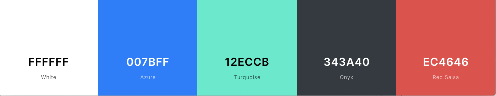
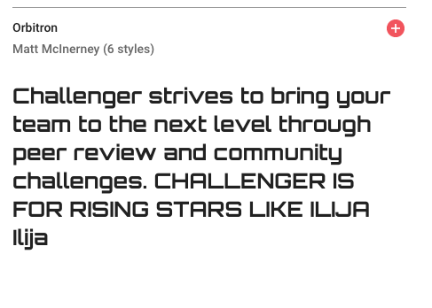
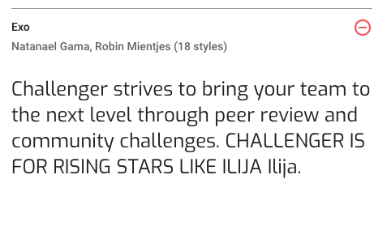
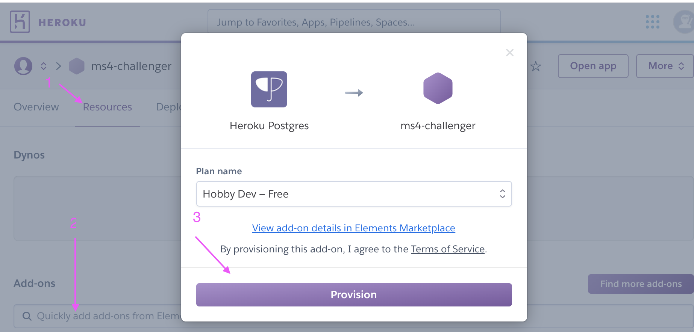

# Challenger

Challenger  - an app to help bring the next level of competition to your group.

[](https://travis-ci.org/maliahavlicek/ms4_challenger)

## Author
Malia Havlicek


## Project Overview

[](http://ms4-challenger.herokuapp.com/)

Challenger provides a way for small groups to test each other with friendly competitions based on common skill sets and interests. Whether you are teaching music lessons, coaching a soccer team or just a group of friends trying to top each other, this forum allows you to quickly set up a group, designate a master of ceremonies and define the limits of the challenge. Members then can load up a video or image of their results. The master of ceremonies can privately grade submissions and peers can rate each others' efforts. Members with a subscription service provide private links to families and fiends of their videos. 

### How to use
Since this application has a wide range of users, I've placed a couple of tutorial videos on the homepage to help users who may be a bit tentative on using the app the very first time. 

- [Register](https://mmh-challenger.s3.us-east-2.amazonaws.com/media/how_to_videos/registration.mp4)
- [Create Challenge](https://mmh-challenger.s3.us-east-2.amazonaws.com/media/how_to_videos/create_challenge.mp4)
- [Submit Entry](https://mmh-challenger.s3.us-east-2.amazonaws.com/media/how_to_videos/submit_entry.mp4)

## Table of Contents

## UX

### Goals
#### Challenge Member Goals

The largest user group for the Challenger website will be those who are challenge members. 
These users are people who want to highlight their talents and skills. They can be students of a music school, members of a sports team, people learning a new language or those that want to share new found skills with like minded peers.

Challenge Member Goals are:
 - Easily see a list of active challenges I belong to
 - Submit a file as a challenge submission
 - Look at peers' challenge submissions
 - Rate a peer's submission
 - Receive an email when a challenge is opened
 - Receive a reminder email when a challenge is nearing closure
 - Review past challenges and their submissions
 - Send a link to friends and family that are not members so they can watch my submissions

#### Master of Ceremonies Goals

Masters of Ceremonies are user that own a challenge. 

Challenge Master Goals are:
- Initiate a challenge to a group of people via email
- Update an existing challenge
- Delete a challenge so I don't have to spend more money if I hit my challenge limit
- Upgrade my account so I can proctor more challenges
- Be notified when a submission has been made
- Approve Submissions before rest of team can see them
- Provide private constructive criticism to challenge members about their submissions

#### Business Goals
- Provide a professional forum that allows users to challenge each other and interact online in a respectful, positive manner
- Provide a safe environment where privacy is key such that younger audience can interact with peers online
- Connect like minded peers 
- Keep track of user self-tagging to inform future cross selling
- Keep track of user feature requests to make informed decisions on improvements

### User Stories
As a member of Challenger's website, I expect/want/need:
- To find a challenge easily, I want the email I receive to take me to the correct challenge immediately
- To easily see my peer's submissions for a challenge and any ratings
- To rate my peer's submissions
- To easily see all the challenges I belong to
- To know which challenges I am the master of and those that I am a member of
- To share a private link of my submission to my friends and family
- To easily set up my account
- To upgrade my account once I know I like the product and am willing to pay for a higher tier
- To be able to tell what my account settings are
- To see what Service Level tiers exist
- To pay for a Service Level securely
- To set up a challenge
- To delete a challenge
- To update an existing challenge

### Wireframes
This product aims to deliver a private small team feel similar to [teamsnap](https://teamsnap.com) and the ability to quickly view and like items similar to [instagram](https://www.instagram.com/). I started wireframes early in the design process while flipping between the two pre-existing apps. Then tackled some tough user interaction like adding members before I invested several hours to mock-up and fine-tuning the user experience around challenges using Balsamiq to create [detailed mockups](documentation/WIREFRAMES.md) like the one below:
[](documentation/WIREFRAMES.md)

### Design Choices

The intent is to provide a clean, intuitive design to users with subtle imagery and animation to spice up the pages in order to keep users engaged.

#### Color Choice
To provide a striking contrast between the header and footer vs the body of the page, onyx and white with bold highlighting colors were picked. 
[](https://coolors.co/ffffff-007bff-12eccb-343a40-ec4646)

To provide a deeper contrast, the background color of the headers/footers versus the body are inverted. For headers and footers onyx is the background color while white is the background color for the body.

Turquoise is a green tone which represents forward action and is used for navigation links and buttons.

Salsa Red is used for warnings.
 
Azure blue was picked to represent textual links to aide older users by staying true to original html link coloration.

#### Typography

The target age group for this site is rather wide. Children from the ages of 10 to octogenarians and beyond could make use of the application. With that in mind, the base font size is 18px to make it easy to read. 

The purpose of the site is to allow peers to interact in friendly challenges from wherever they are geographically. Since the tasks depicted as challenges are aimed to highlight the talents and skills one possesses as well as encourage users to try new things, a futuristic font was chosen to roughly match the feel of star trek, and encourage participants to boldly go where they haven't gone before.

Several Google Fonts were explored and only those without any lower case l and upper case i differentiation issues were chosen.

##### Title Font

[Orbitron](https://fonts.google.com/?query=orbitron&selection.family=Orbitron) 



Titles, navigation links and buttons use the title font. Headings use a base font of 32px and size down.

##### Base Font

[Exo](https://fonts.google.com/?query=orbitron&selection.family=Exo) 



The base font size is 18px to accommodate for a wider age range of users. Exo is a bit easier to read than Orbitron but it has a futuristic feel to it to help carry out the space travel theme. 

#### Image Choice

This site is to be used by people aged 10 to 80 and beyond. Images were picked in an attempt to be colorful with high contrast and within the chosen color palette.

##### Service Levels
Large iconic imagery was selected with bold red colors to help users easily identify with product levels and the price commitment associated with such.

The Free product tier is represented by a balloon:


The Blast Off (Medium Tier) Product is represented by a 1960's rocket ship:


The Interstellar (High End Tier) Product is represented by a futuristic space ship:


#### Design Elements
The formal wire-ream process identified the need for the following User Interface Components:

|                 |             |                    |              |
|-----------------|-------------|--------------------|--------------|
| navigation menu | forms       | button             | email        |
| datepicker      | checkboxes  | multiple selection | cards        |
| icons           | file picker | video player       | audio player |
| tabbed content  | tooltips    | ratings            | carousel     |
| tables          | accordions  | alerts             |              |

To save some development time bootstrap 4 was chosen as the CSS framework. I haven't actually used it before but it's well documented and there are many examples that you can modify and the amount of support is hard to beat. (Hoping to avoid date picker issues I had with bulma)

#### Animations & Transitions

Due to the vast age diversity of users targeted for this website, animations are subtle and slower than average.
If viewed on desktop the rails are filled with a star field image that slowly transitions up and to the left to tie into the space travel/futuristic theme of the website.

## Features

### Implemented Features

#### Page Components 
The wire-frame process identified the need for the following User Interface Components:

#### Home Page

#### Products Page

#### Login Page

#### Register Page

#### Profile Page

#### Logout Page

#### Checkout Page

#### Challenges Page

#### Challenge Detail Page

#### Submission Page

#### Contact Page

#### Terms and Conditions Page

#### Forgot Password Page

#### Reset Password Page

### Features Left to Implement
- Monthly and Annual Pricing Tiers.
- Account Managers/ dual ownership based on Service Levels.
- Private Comments from challenge masters to members about their entries.
- Observer Accounts based on Service Levels.
- Challenge Master Designated Time Limits for audio and video file submissions
- Group Emails initiated by users vs auto generated emails about challenge creation, update, cancellations.

## Information Architecture
Initial Database Structure Considerations, an ERD and details about the Database models, CRUD functionality, model functions and validations can be found in the [DATA.md](documentation/DATA.md) file.

## Technologies Used

This project was developed using Pycharm's IDE. Python 3.7, Django 3.0 and a Postgres Databased served up via Heroku are the core components. 

### Programming Languages

- [CSS3](https://www.w3schools.com/w3css/default.asp) - used to style DOM appearance. 
- [HTML5](https://www.w3schools.com/html/default.asp) -  used to define DOM elements. 
- [JQuery](https://jquery.com) - used to initialize handlers for user interactive elements such as Bootstrap framework pieces like: check boxes, date pickers, menu toggles.
- [JavaScript](https://www.javascript.com/)  -  used to help handle challenge member entry.
- [Python](https://www.python.org/) the project back-end functions are written using Python. Django and Python is used to build route functions.
- [Django](https://docs.djangoproject.com/en/3.0/) Object Relational Mapper, HTML templating, URL routing, Form validation, Authentication, Admin and Security, does a lot of the heavy lifting for a website without much developer input 
- [Markdown](https://www.markdownguide.org/) Documentation within the readme was generated using markdown

### Framework & Extensions

- [dj-database-url](https://pypi.org/project/dj-database-url/) - allows use of environment variable for database connections
- [bootstrap 4](https://getbootstrap.com/docs/4.0/getting-started/introduction/) - a mobile friendly CSS framework based on a responsive grid system. Provides out of the box UI components such as navigation menu bar, carousels, and cards. 
- [django-bootstrap4](https://pypi.org/project/django-bootstrap4/) - Bootstrap 4 integration for Django
- [django-crispy-forms](https://pypi.org/project/django-crispy-forms/) - Allows style and HTML control of Django template form displays
- [django-forms-bootstrap](https://pypi.org/project/django-forms-bootstrap/) - allows further customization of bootstrap forms within Django framework
- [stripe](https://pypi.org/project/stripe/) - A python library to talk to Stripe's API
- [boto3](https://pypi.org/project/boto3/)-  allows Python to talk to AWS SDK so you can store data in S3 buckets 
- [coverage](https://coverage.readthedocs.io/en/coverage-5.1/) - measures and analyzes code coverage of python code
- [django-storages] a collection of custom storage backends with django to work with boto3 and AWS S3.
- [django-multiselectfield](https://pypi.org/project/django-multiselectfield/) - allows checkbox display of multi selects for django
- [graphviz](https://graphviz.readthedocs.io/en/stable/) -used to create graphics from Python
- [django-extensions](https://pypi.org/project/django-extensions/) - collection of management commands for django, used for validating templates, and graphics for models
- [gunicorn](https://pypi.org/project/gunicorn/) - Python WSGI HTTP Server for UNIX so you can host your application
- [pillow](https://pillow.readthedocs.io/en/stable/) -Python Imaging Library to help store imagery into a database
- [psycopg2](https://www.psycopg.org/docs/) - PostgreSQL database adapter for the Python
- [python-dateutil](https://pypi.org/project/python-dateutil/) - extends python datetime
- [pytz](https://pypi.org/project/pytz/) - world timezone calculations


### Fonts

- Base Font: [Orbitron](https://fonts.google.com/?query=orbitron&selection.family=Orbitron) 
- Header Font: [Exo](https://fonts.google.com/?query=orbitron&selection.family=Exo) 
- Button Icons: [Font Awesome 5](https://fontawesome.com/icons?d=gallery)

### Tools
- [Pycharm](https://www.jetbrains.com/) The IDE used for developing ms4-challenger
- [github](https://github.com/) - used for version control of project files and branching out to try different things without adversely affecting a functional set of code
- [travis](https://travis-ci.org/) - supports continuous integration by building the code and running tests before deploying to Heroku
- [balsamiq](https://balsamiq.com/) - used to create professional looking wire frames.
- [favicon generator](https://favicon.io/favicon-generator/) - free site to help in website icon generation
- [markdown table generator](https://www.tablesgenerator.com/markdown_tables) - used to help with documentation table formatting
- [mardown table of contents generator](https://ecotrust-canada.github.io/markdown-toc/) - used to create table of contents (be weary it does have some bugs if you have dashes or trailing spaces in your headers)
- [heroku](https://www.heroku.com/) - runs the ms4-challenger application in the cloud
- [color contrast](https://webaim.org/resourceshttps://webaim.org/resources/contrastchecker//contrastchecker/) Tool was used to adjust colors on fonts flagged as needing a higher contrast ratio from google's lighthouse audit tool.
- [lighthouse audit](https://developers.google.com/web/tools/lighthouse) Google's open source tool to help improve the quality of your website. Specifically paid attention to Accessibility and SEO aiming for scores above 80.
- [axe - web accessibility testing](https://chrome.google.com/webstore/detail/axe-web-accessibility-tes/lhdoppojpmngadmnindnejefpokejbdd?hl=en-US) a chrome extension that helps identify other accessibility issues google's lighthouse tool misses, such as landmarks and headings.
- [loom](https://www.loom.com/) - Free chrome extension to take screen capturing videos with audio 
- [coolers](https://coolors.co/) - Color Scheme generator, used to fine tune color selection and find hover colors
- [coverage](https://coverage.readthedocs.io/en/coverage-5.1/) - used to identify bits code that have been executed, then analyzes the source to identify code that could have been executed but was not.
- [django-extensions](https://pypi.org/project/django-extensions/) - used for validating templates, and graphics for models
- [pip](https://pip.pypa.io/en/stable/installing/) - used to install python extensions for this project
- [django-nose](https://pypi.org/project/django-nose/) - used to help configure and run tests with coverage output


### APIs

- [AWS S3 Bucket](https://docs.aws.amazon.com/AmazonS3/latest/dev/UsingBucket.html) - allows seamless uploading of user files to cloud storage using application credentials
- [stripe](https://stripe.com/) - payment platform to validate and accept credit card payments securely
- ratings - home grown restful api that accepts ratings from users and sends back an average rating for a given entry


## Defensive Programming

Sites with ownership rules and roles opens a site up to hacking especially if your users are savvy and notice url parameters correlate to database object manipulation. Django is pretty good allowing you to hook in login required for views associated with CRUD options, and form validation is top notch if you definite it yourself. Still I felt the need to add a bit more to prevent more tech aware users from doing naughty things:

### Additional Security Checks
1. Users cannot adjust their submissions outside of the challenge start and end dates. The Submission Delete, Submission Update, and Submission Create all check that the timezone adjusted date does not fall outside the Challenge Master's settings.
1. Users cannot Delete or Update other's submissions. The Submit Delete and Submit Update views check for Entry Id's to prevent logged in users from guessing the ID of a peer's entry.
1. Users cannot Update or Delete others' challenges. The Challenge Update and Challenge Delete views check for an owner's id before allowing someone manipulate the settings.
1. Users cannot Update profiles for other users. The Profile Update view checks the user's id against the logged in user's id before allowing updates.
1. Users cannot Checkout and enter a payment unless they are logged in and payments cannot be attributed to other profiles.
1. Changing passwords requires sending registered email link and does not auto log in a user. While it's annoying to have to wait for a password reset email, then to login after setting it, this step prevents users from taking account ownership over if they manipulate a password reset for their account and attempt to hack another's.
1. Before a user can view submissions, challenge ownership/membership is checked
1. Before a user can rate a submission, challenge ownership/membership is checked

### Custom Validation
1. Set up a virtual environment via this command in the terminal session:
   - Emails and user names are unique to the account. 
   - Users must be 13 years or older.
1. Challenges
   - Challenge end dates must be in the future for creation and updates
   - Creation and Updates check current service level of user for submission types and features
   - Before Creation, account limit is checked in case user is sharing account or has another tab open and exceeded limit
1. Submissions
   - Before Creation and Update, dates are checked to ensure user hasn't left a window open hoping to beat time limit
   - File size limits are checked before a user successfully uploads a file
1. Account Management
  - when a user updates their username or email, the system is crosschecked for uniqueness of values
   
   
## Testing

Validation, manual unit, cross browser/cross device, accessibility, travis, coverage, this app has a dash of everything test related. See the separate [TESTING.md](documentation/TESTING.md) file for the details.

## Deployment

This application can be run locally or deployed to a live environment. Directions are provided for deploying to Heroku.

### Requirements
If any of the following are unfamiliar, please click on their associated links as they are necessary when setting the environmental variables required to run this application:

 - an IDE such as [pycharm](https://www.jetbrains.com/pycharm/download) - a tool to help develop software
 - [PIP](https://pip.pypa.io/en/stable/installing/) - coordinates python installation packages
 - [python 3](https://www.python.org/downloads/) - Python is a programming language that lets you work more quickly and integrate your systems more effectively.
 - [git](https://gist.github.com/derhuerst/1b15ff4652a867391f03) -  version control system for code source
 - a [gmail accoount](https://accounts.google.com/signup) with less secure app access turned on use [this link](https://myaccount.google.com/lesssecureapps?pli=1) after you are signed into the gmail account - allows system to send email notifications such as password reset and user registration links
 - a [stripe account](https://stripe.com/) - used to securely collect payments, testing API's level is fine unless you want collect payments for real
 - [AWS-S3 (Amazon Web Services - Simple Storage Storage Account)](https://docs.aws.amazon.com/AmazonS3/latest/gsg/SigningUpforS3.html) - web based cloud storage service for online backup of website assets
 - [S3 Bucket](https://docs.aws.amazon.com/AmazonS3/latest/gsg/CreatingABucket.html) - a cloud storage resource which is similar to file folders on a computer's hard drive


### Local
1. Save a copy of the github repository located at https://github.com/maliahavlicek/ms4_challenger by clicking the 'download.zip' button at the top of the page and extracting the zip file to your chosen folder. If you have Git installed on your system, you can clone the repository with the following command:
   ```bash
   $ git clone https://github.com/maliahavlicek/ms4_challenger.git
   ```
1. Open your preferred IDE, then open a terminal session in the unzip folder or cd to the correct location.
1. Set up a virtual environment via this command in the terminal session:
   ```bash 
   python3 manage.py
   ``` 
   > NOTE: The ```python``` prefix of this command and other steps below assumes you are working with a mac and pycharm's IDE. Your command may differ, such as ```python -m .venv venv ...``` or ```py manage.py ...``` or ```.\manage.py ...```
1. Activate the .venv with the command:
   ```bash 
   .venv\Scripts\activate
   ```
   > Again this command may differ depending on your operating system, please check the Python Documentation on [virtual environments](https://docs.python.org/3/library/venv.html) for further instructions.
1. If needed, Upgrade pip locally with:
   ```bash
   pip install --upgrade pip
   ```
1. Install all required modules with the command:
   ```bash
   pip install -r requirements.txt
   ```
1. Create a new file at the base ms4_challenge directory level called env.py:
   ```python
   touch env.py
   ```
1. Copy the following into the env.py file:
    ```python
    import os
    
    os.environ.setdefault('HOSTNAME', '<your value>')
    os.environ.setdefault('STRIPE_PUBLISHABLE', '<your value>')
    os.environ.setdefault('STRIPE_SECRET', '<your value>')
    os.environ.setdefault('SECRET_KEY', '<your value>')
    os.environ.setdefault('AWS_STORAGE_BUCKET_NAME', '<your value>')
    os.environ.setdefault('AWS_S3_REGION_NAME', '<your value>')
    os.environ.setdefault('AWS_ACCESS_KEY_ID', '<your value>')
    os.environ.setdefault('AWS_SECRET_ACCESS_KEY', '<your value>')
    os.environ.setdefault('EMAIL_USER', '<your value>')
    os.environ.setdefault('EMAIL_PASS', '<your value>')
    ```
1. Replace <your value> with the values from your own accounts
    - HOSTNAME - should be the local address for the site when running within your own IDE.
    - STRIPE_PUBLISHABLE - From Developer's API on (stripe dashboard)[https://dashboard.stripe.com/test/apikeys]
    - STRIPE_SECRET - From Developer's API on (stripe dashboard)[https://dashboard.stripe.com/test/apikeys]
    - SECRET_KEY -is a django key a long random string of bytes. For example, copy the output of this to your config: 
        ```bash
       python -c 'import os; print(os.urandom(16))'
        ```
    - AWS_STORAGE_BUCKET_NAME - can be found on your [bucket dashboard ](https://console.aws.amazon.com/s3/home)
    - AWS_S3_REGION_NAME - can be found your [bucket dashboard ](https://console.aws.amazon.com/s3/home), note, the interface has some textual description prefacing the region, the region is after the closing parenthesis descriptor. For Example ```US East(N. Virginia) us-east-1```, the region is ```us-east-1```
    - 
1. Set up the databases by running the following management command in your terminal:
    ```bash
    python manage.py migrate
    ```
   > If you restarted your machine to activate your environment variables, do not forget to reactivate your virtual environment with the command used at step 4.
1. Create the superuser so you can have access to the django admin, follow the steps necessary to set up the username, email and password by running the following management command in your terminal:
    ```bash
    python manage.py createsuperuser
    ```
1. Preload products and tags. To match starter projects and user profile tags to the original concept, run the following commands from your IDE's terminal:
    ```bash
    python manage.py loaddata servicelevel.json
    python manage.py loaddata tag.json
    ```

1. Start your server by running the following management command in your terminal:
    ```bash
    python manage.py runserver
    ```
1. If you make changes to CSS or Javascript files, be sure to run the management command to collect the static files so they are pulled into the AWS storage:
    ```bash
    python manage.py collectstatic
    ```

### Heroku

To run this application in a cloud environment to allow visibility to external users, you can deploy the code to Heroku. If you wish to do the same, follow the steps below. Please note this section assumes you have succeeded at running the application in your local environment first.


1. Login to Heroku and set up a new app with a unique name (something like ```<yourname>-challenger```)
1. On the Resources tab, in the Add-ons field type ``` Heroku Postgres``` select the default Hobby Dev - Free tier, then click the Provision button:

 This will provision a Postgres Database for you and automatically add a ```DATABASE_URL``` Config var.
1. Go to the Settings tab, click Reveal Config Vars and copy the DATABASE_URL value into your local memory.
1. In your IDE, open the env.py file add the following line to the file and paste in your DATABASE_URL value:
    ```python
    os.environ.setdefault('DATABASE_URL','<your DATABASE_URL value>')
    ```
1. In heroku for your newly created app, go back to the Settings tab, and click Reveal Config Vars. This time you will be copying the values from your env.py file into heroku. Make sure you load following:
    
    |           Key           |      Value     |
    |:-----------------------:|:--------------:|
    | HOSTNAME                | < your value > |
    | STRIPE_PUBLISHABLE      | < your value > |
    | STRIPE_SECRET           | < your value > |
    | SECRET_KEY              | < your value > |
    | AWS_STORAGE_BUCKET_NAME | < your value > |
    | AWS_S3_REGION_NAME      | < your value > |
    | AWS_ACCESS_KEY_ID       | < your value > |
    | AWS_SECRET_ACCESS_KEY   | < your value > |
    | EMAIL_USER              | < your value > |
    | EMAIL_PASS              | < your value > |
    | DATABASE_URL            | < your value > |
    | DISABLE_COLLECTSTATIC   | 1              |

1. Because this is a new database, you will to set up the databases by running the following management command in your terminal:
    ```bash
    python manage.py migrate
    ```
   > If you restarted your machine to activate your environment variables, do not forget to reactivate your virtual environment with the command used at step 4.
1. Create the superuser for the postgres database so you can have access to the django admin, follow the steps necessary to set up the username, email and password by running the following management command in your terminal:
    ```bash
    python manage.py createsuperuser
    ```
1. Preload products and tags. To match starter projects and user profile tags to the original concept, run the following commands from your IDE's terminal:
    ```bash
    python manage.py loaddata servicelevel.json
    python manage.py loaddata tag.json
    ```

1. In the event packages have been updated, it's best to re-create the requirements.txt file using the terminal command prompt: 
    ```bash
    pip freeze > requirements.txt
    ```
1. Create a Procfile:
    ```bash
    echo web: gunicorn ms4_challenger.wsgi:application > Procfile
    ```
1. Add the files if they changed and push to git hub:
    ```bash
   git commit add Procfile
   git commit add requirements.txt
   git commit-m 'getting ready to deploy to heroku'
   git push -u origin
   ``` 
1. From the heroku dashboard of your newly created application, click on the "Deploy" tab, then scroll down to the "Deployment method" section and select GitHub.
1. Use the github linking and type in the name of the repository ex:) ms4_challenger and click the search button. Then connect the heroku app to the desired GitHub repository.
1. On the Deployment Tab, scroll a bit further down to the "Manual Deploy" section, select the master branch then click "Deploy Branch".
1. If you have errors, look at the logs for your application, most common errors are forgetting to add the hostname and  disabling collectstatic.
1. Once your application is running, you may want to update the Deployment method from Manual to Automatic.


## Credits

No website can be created without the community resources found on the web. Searching [stackoverflow](https://stackoverflow.com/) and [GeeksfoGeeks](https://www.geeksforgeeks.org/) and reading blog about triumphs and fails has helped create this site. A special shout out for the articles that solved specific issues vs syntax questions can be found in the acknowledgements section.

### Content

- The Product Level content was my own creation, but I did use the concept of a subscription based product pricing tier from [teamsnap](https://www.teamsnap.com/) 

### Media
- [flavicon](https://www.google.com/url?sa=i&url=https%3A%2F%2Fclipartix.com%2Frocket-clipart-image-11754%2F&psig=AOvVaw3osFDBKQwlWi5l_ED0kzix&ust=1588579579787000&source=images&cd=vfe&ved=0CA0QjhxqFwoTCKifqZ6el-kCFQAAAAAdAAAAABAD) rocket falvicon image before recoloring and rotation 
- [interstellar product image](https://www.stickpng.com/img/cartoons/little-einsteins/little-einsteins-rocket-ship
) - futuristic space craft
- [blast off product image](https://www.flaticon.com/free-icon/startup_639373?term=rocket&page=1&position=23) - 1970's rocket ship
- [free product image'](https://www.flaticon.com/free-icon/hot-air-balloon_2233035?term=hot%20air%20balloon&page=1&position=27) - hot air balloon

### Acknowledgements
- [ragoli](https://codemyui.com/parallax-pixel-stars-using-pure-css/) animated star field background for desktop
- [coderwall](https://coderwall.com/p/mvsoyg/django-dumpdata-and-loaddata) for examples on how to dump data and load it which saves a bunch of time when deploying the application from a local database to a hosted database
- [Wade Williams](https://wadewilliams.com/technology-software/generating-erd-for-django-applications/)- blog walking you through how to create ERD's from django automatically. Saved me a ton of time struggling with draw.io
- [Dennis Ivy](https://dennis-sourcecode.herokuapp.com/) - countless tutorials about Django 3 to fill the gap from Django 1.1, thanks so much for the Profile, Stripe and ManyToMany coverage.
- [Vishal](https://pynative.com/python-generate-random-string/) - how to create a random string in python, used for auto password creation
- [Learning about Electronics](http://www.learningaboutelectronics.com/Articles/How-to-create-a-video-uploader-with-Python-in-Django.php) - how to get a video file uploaded and displaying
- [pypi.org](https://pypi.org/) - used to search for plugins that would help with form presentation and many other inquiries
- [Vitor Freitas](https://simpleisbetterthancomplex.com/tips/2016/09/06/django-tip-14-messages-framework.html) - Thank you so much for documenting how use the Messages Framework.
- [Anil Zaimi](https://azmind.com/bootstrap-carousel-multiple-items/) - For blogging about how to have multiple cards in a bootstrap carousel