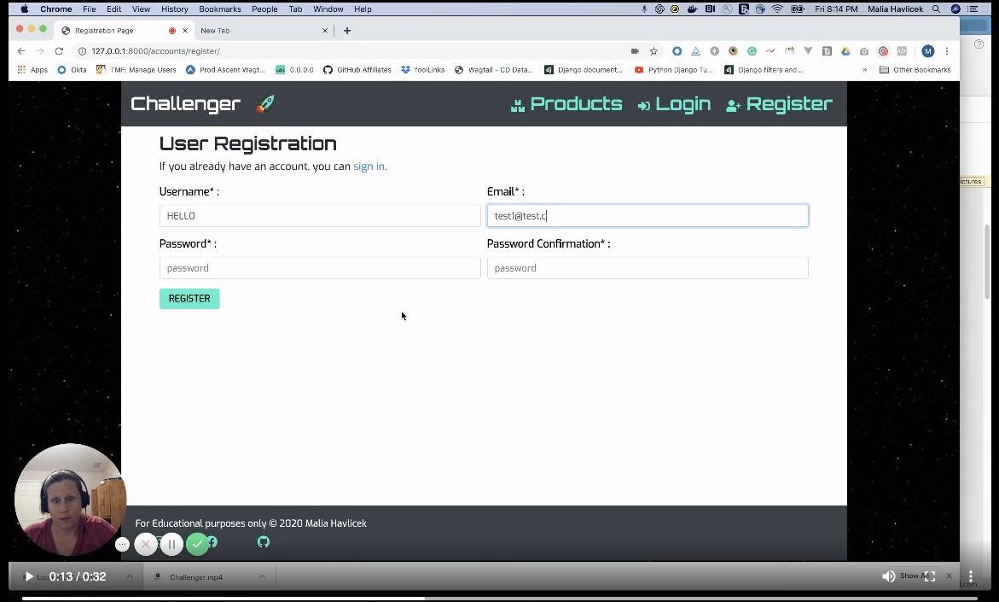
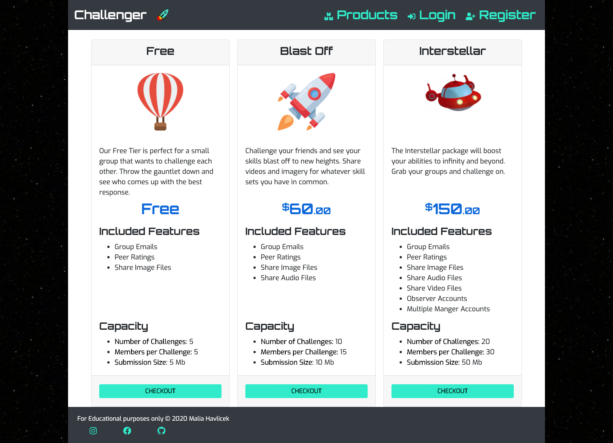
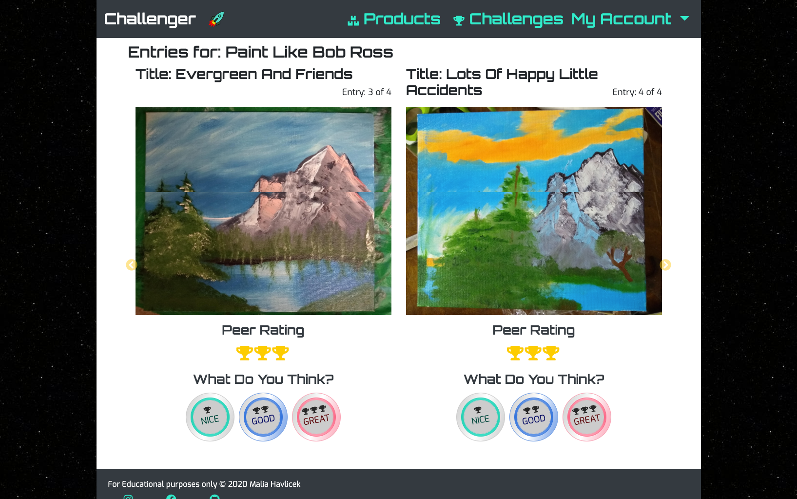
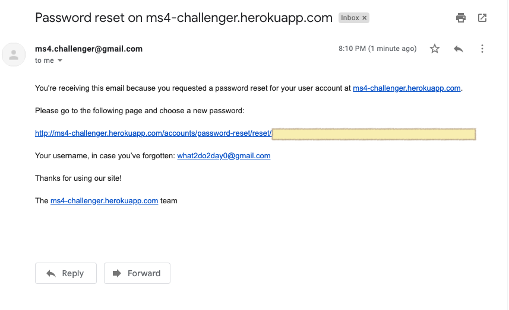

# Challenger

Challenger  - an app to help bring the next level of competition to your group.

[](https://travis-ci.org/maliahavlicek/ms4_challenger)

## Author
Malia Havlicek


## Project Overview

[](http://ms4-challenger.herokuapp.com/)

Challenger provides a way for small groups to test each other with friendly competitions based on common skill sets and interests. Whether you are teaching music lessons, coaching a soccer team or just a group of friends trying to top each other, this forum allows you to quickly set up a group, designate a master of ceremonies and define the limits of the challenge. Members then can load up a video or image of their results. The master of ceremonies can privately grade submissions and peers can rate each others' efforts. Members with a subscription service provide private links to families and fiends of their videos. 

### How to use
Since this application has a wide range of users, I've placed a couple of tutorial videos on the homepage to help users who may be a bit tentative on using the app the very first time. 

Register

<a href="https://mmh-challenger.s3.us-east-2.amazonaws.com/media/how_to_videos/registration.mp4" target="_blank"></a>

Create Challenge

<a href="https://mmh-challenger.s3.us-east-2.amazonaws.com/media/how_to_videos/create_challenge.mp4" target="_blank"></a>

Submit Entry

<a href="https://mmh-challenger.s3.us-east-2.amazonaws.com/media/how_to_videos/submit_entry.mp4" target="_blank"></a>


## Table of Contents
>- [UX](#ux)
>  * [Goals](#goals)
>    + [Challenge Member Goals](#challenge-member-goals)
>    + [Challenge Master Goals](#challenge-master-goals)
>    + [Business Goals](#business-goals)
>  * [User Stories](#user-stories)
>  * [Wireframes](#wireframes)
>  * [Design Choices](#design-choices)
>    + [Color Choice](#color-choice)
>    + [Typography](#typography)
>      - [Title Font](#title-font)
>      - [Base Font](#base-font)
>    + [Image Choice](#image-choice)
>      - [Service Levels](#service-levels)
>    + [Design Elements](#design-elements)
>    + [Animations & Transitions](#animations--transitions)
>- [Features](#features)
>  * [Implemented Features](#implemented-features)
>    + [Page Components](#page-components)
>      - [Navigation Menu](#navigation-menu)
>          + [Desktop](#desktop)
>          + [Mobile](#mobile)
>      - [Date Picker](#date-picker)
>      - [Buttons](#buttons)
>        * [No Icons](#no-icons)
>        * [With Icons](#with-icons)
>      - [Check Boxes & Multiple Selection](#check-boxes--multiple-selection)
>      - [Cards](#cards)
>      - [File Pickers](#file-pickers)
>      - [Video Player](#video-player)
>      - [Audio Player](#audio-player)
>        * [Tabbed Content](#tabbed-content)
>      - [Tooltips](#tooltips)
>      - [Ratings Inputs](#ratings-inputs)
>      - [Ratings Aggregated](#ratings-aggregated)
>      - [Carousel](#carousel)
>      - [Tables and Accordions](#tables-and-accordions)
>      - [Forms](#forms)
>      - [Alerts](#alerts)
>    + [Home Page](#home-page)
>    + [Products Page](#products-page)
>    + [Login Page](#login-page)
>    + [Register Page](#register-page)
>    + [Profile Page](#profile-page)
>    + [Change User Info Page](#change-user-info-page)
>      - [Update Profile Page](#update-profile-page)
>    + [Checkout Page](#checkout-page)
>    + [Challenges Page](#challenges-page)
>      - [Challenge Member Tab](#challenge-member-tab)
>        * [Open](#open)
>          + [Submit](#submit)
>          + [Re-Submit](#re-submit)
>        * [Closed](#closed)
>      - [Challenge Master Tab](#challenge-master-tab)
>      - [Create Challenge Tab](#create-challenge-tab)
>    + [Create Challenge.](#create-challenge)
>      - [Welcome to Challenger Email](#welcome-to-challenger-email)
>      - [Welcome to the Challenge Email](#welcome-to-the-challenge-email)
>    + [Update Challenge Page](#update-challenge-page)
>      - [Challenge Updated Email](#challenge-updated-email)
>      - [Challenge Terminated Email](#challenge-terminated-email)
>    + [Submit Entry Page](#submit-entry-page)
>    + [Re-submit Entry Page](#re-submit-entry-page)
>    + [See All Entries Page](#see-all-entries-page)
>    + [Password Reset Initiate Page](#password-reset-initiate-page)
>    + [Reset Password Link Sent Page](#reset-password-link-sent-page)
>    + [Reset Password Email](#reset-password-email)
>      - [Password Reset Entry Page](#password-reset-entry-page)
>      - [Password Reset Complete Page](#password-reset-complete-page)
>  * [Features Left to Implement](#features-left-to-implement)
>- [Information Architecture](#information-architecture)
>- [Technologies Used](#technologies-used)
>  * [Programming Languages](#programming-languages)
>  * [Framework & Extensions](#framework--extensions)
>  * [Fonts](#fonts)
>  * [Tools](#tools)
>  * [APIs](#apis)
>- [Defensive Programming](#defensive-programming)
>  * [Additional Security Checks](#additional-security-checks)
>  * [Custom Validation](#custom-validation)
>- [Testing](#testing)
>- [Deployment](#deployment)
>  * [Requirements](#requirements)
>  * [Local](#local)
>  * [Heroku](#heroku)
>- [Credits](#credits)
>  * [Content](#content)
>  * [Media](#media)
>  * [Acknowledgements](#acknowledgements)

# UX

## Goals
### Challenge Member Goals

The largest user group for the Challenger website will be those who are challenge members. 
These users are people who want to highlight their talents and skills. They can be students of a music school, members of a sports team, people learning a new language or those that want to share new found skills with like minded peers.

Challenge Member Goals are:
 - Easily see a list of active challenges I belong to
 - Submit a file as a challenge submission
 - Look at peers' challenge submissions
 - Rate a peer's submission
 - Receive an email when a challenge is opened
 - Receive a reminder email when a challenge is nearing closure
 - Review past challenges and their submissions
 - Send a link to friends and family that are not members so they can view my submissions

### Challenge Master Goals

Challenge Masters are user that created have created a challenge. 

Challenge Master Goals are:
- Initiate a challenge to a group of people via email through an intuitive interface
- Update an existing challenge without much hassle
- Delete a challenge so I don't have to spend more money if I hit my challenge limit
- Upgrade my account so I can proctor more challenges
- Be notified when a submission has been made
- Approve Submissions before rest of team can see them
- Provide private constructive criticism to challenge members about their submissions

### Business Goals
- Provide a professional forum that allows users to challenge each other and interact online in a respectful, positive manner
- Provide a safe environment where privacy is key such that adults will be comfortable allowing minor-aged members to interact with peers online via the Challenger forum
- Connect like-minded peers on a stable, scalable platform
- Keep track of user self-tagging to be aligned to make informed decisions about cross-selling and ad space revenue
- Keep track of user feature requests to make informed decisions on improvements and enhancements so my site stays ahead of the crowd

## User Stories
As a member of Challenger's website, I expect/want/need:
- To find a challenge easily, I want the email I receive to take me to the correct challenge immediately
- To easily see my peer's submissions for a challenge and see an averaged group rating for each entry
- To be able to rate my peer's submissions and change my mind as much a I desire about the ratings I give
- To easily see all the challenges I belong to
- To know which challenges I am the master of and those that I am a member of
- To share a private link of my submission to my friends and family so they can see the cool stuff I am doing
- To easily set up my account
- To retrieve a new password without too many hoops if I forgot what it was
- To upgrade my account with very few steps once I know I like the product and am willing to pay for a higher tier
- To downgrade my account if I discover I'm not using the site as much at a future time to save money
- To be able to tell what my account settings are easily and know when I made changes to my service level
- To see what Service Level tiers exist at what price points and terms without digging through pages of documentation
- To pay for a Service Level securely 
- To set up a challenge for my friends easily if I find I like being a member
- To delete my entry form a challenge at any time because it embarrasses me
- To update an entry fast because I am ever so fond of typos
- To update an existing challenge because my description wasn't clear or I uploaded the wrong file
- To report abusive content anonymously so I don't see offensive things and minors don't either 

## Wireframes
This product aims to deliver a private small team feel similar to [teamsnap](https://teamsnap.com) and the ability to quickly view and like items similar to [instagram](https://www.instagram.com/). I started wireframes early in the design process while flipping between the two pre-existing apps. Then tackled some tough user interaction like adding members before I invested several hours to mock-ups and fine-tuning the user experience. Once I had a handle on the scope of challenges, I utilized Balsamiq to create [detailed mockups](documentation/WIREFRAMES.md) like the one below:
[](documentation/WIREFRAMES.md)

## Design Choices

The intent is to provide a clean, intuitive design to users with subtle imagery and animation to spice up the pages in order to keep users engaged.

### Color Choice
To provide a striking contrast between the header and footer vs the body of the page, onyx and white with bold highlighting colors were picked. 
[](https://coolors.co/ffffff-007bff-12eccb-343a40-ec4646)

To provide a deeper contrast, the background color of the headers/footers versus the body are inverted. For headers and footers onyx is the background color while white is the background color for the body.

Turquoise is a green tone which represents forward action and is used for navigation links and buttons.

Salsa Red is used for warnings.
 
Azure blue was picked to represent textual links to aide older users by staying true to original html link coloration. Note in cases of contrast warning, the colors may have been slightly muted or brightened to overcome WCAG compliance issues due to dark and light backgrounds.

### Typography

The target age group for this site is rather wide. Children from the ages of 10 to octogenarians and beyond could make use of the application. With that in mind, the base font size is 18px to make it easy to read. 

The purpose of the site is to allow peers to interact in friendly challenges from wherever they are geographically. Since the tasks depicted as challenges are aimed to highlight the talents and skills one possesses as well as encourage users to try new things, a futuristic font was chosen to roughly match the feel of star trek, and encourage participants to boldly go where they haven't gone before.

Several Google Fonts were explored and only those without any lower case l and upper case i differentiation issues were chosen.

#### Title Font
Titles, navigation links and buttons use the [Orbitron](https://fonts.google.com/?query=orbitron&selection.family=Orbitron) font. Headings use a base font of 32px and size down to 20px.


#### Base Font
The base font size is 18px to accommodate for a wider age range of users. [Exo](https://fonts.google.com/?query=orbitron&selection.family=Exo) is a bit easier to read than Orbitron but it has a futuristic feel to it to help carry out the space travel theme. 


### Image Choice

This site is to be used by people aged 10 to 80 and beyond. Images were picked in an attempt to be colorful with high contrast and within the chosen color palette.

#### Service Levels
Large iconic imagery was selected with bold red colors to help users easily identify with product levels and the price commitment associated with such.

The Free product tier is represented by a balloon:


The Blast Off (Medium Tier) Product is represented by a 1960's rocket ship:


The Interstellar (High End Tier) Product is represented by a futuristic space ship:


### Design Elements
The formal wire-frame process identified the need for the following User Interface Components:

|                 |             |                    |              |
|-----------------|-------------|--------------------|--------------|
| navigation menu | forms       | button             | email        |
| datepicker      | checkboxes  | multiple selection | cards        |
| icons           | file picker | video player       | audio player |
| tabbed content  | tooltips    | ratings            | carousel     |
| tables          | accordions  | alerts             |              |

To save some development time bootstrap 4 was chosen as the CSS framework. I haven't actually used it before but it's well documented and there are many examples that you can modify and the amount of support is hard to beat. (Hoping to avoid date picker issues I had with bulma)

### Animations & Transitions

Due to the vast age diversity of users targeted for this website, animations are subtle and slower than average.
If viewed on desktop the rails are filled with a star field image that slowly transitions up and to the left to tie into the space travel/futuristic theme of the website. 

The order history is held in an accordion that has animation to expose and hide it's contents.

The See All Entries view has an animated carousel that auto plays unless it's being interacted with.

# Features

User goals cross over many pages within the MS4-Challenger site. To best organize thoughts, the implemented features were broken down by pages users can access.
 
 Main features that were deferred to a later date can be found in the [features left to implement section](#features-left-to-implement)

## Implemented Features

The features implemented are documented with desktop screenshots. There were fully tested on small devices but the ease of organizing data from phone screenshots was not a task I was willing to take.

### Page Components 
The wire-frame process identified the need for the following User Interface Components:

#### Navigation Menu
To provide users with an easy intuitive navigation, main links are in an ever present top navigation bar.

###### Desktop


###### Mobile


#### Date Picker
The default bootstrap via crispy form date picker is rendered.


#### Buttons
Buttons abound on the site. They stick to the same primary green color unless they are associated with canceling or deleting options. Icons are used with the buttons on the challenges tabs to help differentiate them from each other.

##### No Icons


##### With Icons


#### Check Boxes & Multiple Selection
Check boxes are notoriously small and multi selection drop downs are cumbersome for users. I enhanced the size of the checkboxes and display multi-selections as a group of checkboxes:


#### Cards
Bootstrap has a nice flex box container with some predefined behaviors. I used the card-deck enhancement on the products page. I still had issues with inner heights so I added some custom [jQuery](https://github.com/maliahavlicek/ms4_challenger/blob/master/static/js/utils.js) to even the heights based on CSS classes within the on page ready function.  


#### File Pickers
I used the default file pickers, but would love to take the time to restyle


#### Video Player
I used the default video players and didn't find much on how to make them standardized across browsers. I did add an outline as some browsers put them up with just a play button and no background.  I would love to take the time to restyle these across the site for all browsers.


To keep the look and feel of this repeated element the same and easy to maintain, I created a custom [inclusion_tag](https://github.com/maliahavlicek/ms4_challenger/blob/64c67ed7a8494ca82a74af87d9f834000b1e50d9/challenges/templatetags/filters.py#L49), which passes context over to a common rendering [template](https://github.com/maliahavlicek/ms4_challenger/blob/64c67ed7a8494ca82a74af87d9f834000b1e50d9/challenges/templates/challenges/video_player.html#L2).

#### Audio Player
I used the default audio players but could not figure out the exact controls to standardize background colors and border shapes. Like the video player, I did add an outline as some browsers put them up with a white background and black controls with no background.  I would love to take the time to restyle these across the site for all browsers.


##### Tabbed Content
I used bootstraps tabbed content but modified it be WCAG compliant for aria roles and names. Then styled to fit the color scheme of the site. The tabs are found on the challenge page to help compartmentalize challenges users are members of and those that they are the master of and house the create functionality so users do not have to dig through navigation to find them.


#### Tooltips
Tooltips are used to help minimize content on mobile challenge views and hide descriptions of challenges if a user has submitted an entry. I restyled them to match the color scheme and remove the semitransparent background. 


#### Ratings Inputs
Ratings are custom buttons that I created using [CSS](https://github.com/maliahavlicek/ms4_challenger/blob/64c67ed7a8494ca82a74af87d9f834000b1e50d9/ratings/static/css/ratings.css#L44). The buttons are consolidated and styled differently on small devices to allow them to sit side by side on the smallest phones.


The ability to submit from these buttons is done through a custom [API](https://github.com/maliahavlicek/ms4_challenger/blob/64c67ed7a8494ca82a74af87d9f834000b1e50d9/ratings/views.py#L14) using a JavaScript [fetch](https://github.com/maliahavlicek/ms4_challenger/blob/64c67ed7a8494ca82a74af87d9f834000b1e50d9/ratings/static/js/rating.js#L52).

#### Ratings Aggregated
The aggregated rating is made with some pretty slick [CSS](https://github.com/maliahavlicek/ms4_challenger/blob/64c67ed7a8494ca82a74af87d9f834000b1e50d9/static/css/styles.css#L405). The results from the ajax post to the Ratings API is used with a calc to produce the shaded vs Yellow Trophies peers give each other.  


Aggregated ratings are updated on the fly if a user successfully posts to the custom API via [JavaScript](https://github.com/maliahavlicek/ms4_challenger/blob/64c67ed7a8494ca82a74af87d9f834000b1e50d9/ratings/static/js/rating.js#L82).

They are rendered by using a common [template](https://github.com/maliahavlicek/ms4_challenger/blob/64c67ed7a8494ca82a74af87d9f834000b1e50d9/ratings/templates/aggregate_rating.html#L2) that's included with a combination of custom [filters](https://github.com/maliahavlicek/ms4_challenger/blob/64c67ed7a8494ca82a74af87d9f834000b1e50d9/challenges/templatetags/filters.py#L41)


#### Carousel
The All Submissions page is presented as a carousel. It auto rotates through the submissions unless the user interacts with it.


The side by side slider functionality seen on desktop is handled through [jQuery](https://github.com/maliahavlicek/ms4_challenger/blob/64c67ed7a8494ca82a74af87d9f834000b1e50d9/ratings/static/js/rating.js#L96) and [CSS](https://github.com/maliahavlicek/ms4_challenger/blob/64c67ed7a8494ca82a74af87d9f834000b1e50d9/ratings/static/css/ratings.css#L199). 

#### Tables and Accordions
I display the payment history on the account overview as a button button that is an accordion that expands a payment history table.


#### Forms 
Despite being built with Bootstrap, the forms are all customized to insure a tight, user friendly, not super spacious set of input fields are presented to the users. Here's a view of the create challenge form on a small device (340 wide)


Most forms utilize a crispy layout defined the their respective [forms.py](https://github.com/maliahavlicek/ms4_challenger/blob/64c67ed7a8494ca82a74af87d9f834000b1e50d9/challenges/forms.py#L75) files. If custom  [validation](https://github.com/maliahavlicek/ms4_challenger/blob/64c67ed7a8494ca82a74af87d9f834000b1e50d9/challenges/forms.py#L55) is needed, it's defined in the forms.py file too.

For the collecting members on creating and updating challenges forms, custom [JavaScript](https://github.com/maliahavlicek/ms4_challenger/blob/64c67ed7a8494ca82a74af87d9f834000b1e50d9/challenges/static/js/challenge.js#L16) is used to prevent needless chatter back and forth from the servers. I could have used a custom API or context listeners but that could bog down the server if there thousands of users doing similar requests at the same time. Thus, I have the client side handling for the embedded member input form and removal buttons. The data on the form is passed and prepopulated by stringifying JSON.

#### Alerts
Django's messaging is used throughout the site. To provide consistent user action feedback Bootstrap alerts are used below the header and above the Page Title heading. I make use of the yellow for warnings, red for errors and green for success messages.


Messages are set in [views.py](https://github.com/maliahavlicek/ms4_challenger/blob/64c67ed7a8494ca82a74af87d9f834000b1e50d9/challenges/views.py#L46) files before redirecting or rendering templates.

### Home Page
The Home page displays verbiage about why the site exists and what needs it meets. It also provides tutorials to help users get familiar with the site quickly. Authentication is not required to see this page.


### Products Page
The Products page displays the service levels that the MS4-challenger app provides. It displays a brief overview of the features side by side in desktop so users can make a quick choice about what product they want. Price points are above the page fold. For small devices the items are stacked vertically with the lowest price point and predicted highest used product first. Authentication is not required to see this page.

Once a user is logged in the current product associated with their account will have the checkout button grayed out. If a user clicks on a checkout button, they will be required to authenticate. By default a user is assigned the Free product. 



To keep a consistent look of the price object on the checkout page as well as the products list page, a custom [filter](https://github.com/maliahavlicek/ms4_challenger/blob/64c67ed7a8494ca82a74af87d9f834000b1e50d9/products/templatetags/products_tags.py#L9) was made so a ton of tedious HTML didn't have to be repeated.

### Login Page
The login page is the front door for the authenticated user experience. It has a password reset and registration link so users that can't remember their password or those new to the site that want to join do not have to hunt and search for those options.


### Register Page

The Registration Page provides a way for users to sign up for access to the authenticated services provided by the challenger site. Usernames are unique to the system as are emails. 


### Profile Page

The profile page is a one stop shop account overview page. Users can initiate a password reset, make changes to their user information, update their profile, change their service level and see their order history.


### Change User Info Page

The Change user information page allows the user to update information tightly tied to the django default user. If a new version of this application is developed, it would be best to make a custom user object immediately rather than using the default out of the box one.

This form checks to make sure when updating the username or password that you cannot take over another user's account.


#### Update Profile Page

The update profile page allows a user to set/change more personalized information associated with their account like their avatar and interests. Ideally this information would be collect when a user registers, but for the initial deployment it is opt in only.


### Checkout Page
When a user clicks the checkout button for a product with a price value greater than 0, then they are taken to a checkout page where payment information is collected using stripe's payment API.


Payment details are whipped from the page before a status it passed onto the backend server and are never stored in the system or sent across except through the iframe protocols hosted by stripe.

At this point, the stripe payment collection is only in test most, so for success provide a future expiry date and ```4242424242424242``` as the Credit Card Number.

### Challenges Page
One could have guessed that the challenges page would be the most complex of the site. It's the hub of activity.
When the user lands on the page they are presented 3 tabs. 

#### Challenge Member Tab
The first and default displayed tab on the challenges page is the member's tab. This tab recaps the challenges a user belongs to.


All the data on the Member tab is ordered by Challenge End Date from most future to most recent in past, then by name ascending.

There are many iterations of what users might see on this tab. There are 2 main states of a challenge:

##### Open

An open challenge indicates that it is active and that the end date has not yet passed. Users can submit or resubmit their entries during this window. They cannot vote on each others or see other submissions until the challenge has closed.

An open challenge has two sub states:

###### Submit
The user sees the example image and example video if one was supplied as well as the description if the challenge has no entry from associated to the user.


###### Re-Submit
If the user has submitted an entry, the documents they uploaded will be displayed along with re-submit and delete buttons.


Depending on the challenge master's service level, the type of files requested for a submission might change. They could also have a
video:


or audio file:


##### Closed
If the end date has passed, the presentation of the member recap changes slightly. The challenge member will see a button labeled SEE ENTRIES which is the portal to review other's entries if any were made.


If they did not submit an entry their recap-entry box will be empty.


#### Challenge Master Tab
The Challenges Master tab is similar to the Member's content except the user is the owner of the challenge and has update and delete authority. It shows additional buttons to edit or delete a challenge as well as recaps the number of members and submissions for each challenge the user is a master of. If there are submissions, the SEE ENTRIES gateway button to all entries for the challenge will be displayed.


#### Create Challenge Tab
The create challenge tab's treatment is conditional. If the user is at their limit of challenges, they cannot create a new challenge. They are provided a recap screen with some directions about how to free up challenges or raise their limit.


### Create Challenge.
Creating a challenge takes just a minute unless you waste your time word-smithing the description.  There form requires the name, example image, description, start date, end date and submission type in order to pass validation.

Example video files take only ```*.mov``` and ```*.mp4``` entries at this time. 


Adding members is optional. But if you add them, they are bound by your service level agreement. In the screenshot below, the challenge master has the Free tier and is limited to 5 members.


If you create a challenge, you will be messaged at the top of the challenges page if invites were sent or if you need to add members. If a user isn't in the system yet, no worries, their account is auto created, they receive a welcome email with an automatically generated password. They then receive a follow up invite to join the challenge email. 


#### Welcome to Challenger Email
If a user is auto created via being added as a member to a challenge, a welcoming email with their username and password.


This email is in text format only.

#### Welcome to the Challenge Email
Once a user has been added to a challenge, they are sent an email with the details and a link back to the application.


This email is sent as both text and HTML so they example image can be used to entice participation.

### Update Challenge Page
The challenge update page is very similar to the create challenge page, but it provides a preview of the example image and example video and pre-populates the field forms. Users can be added and removed from this page. 


The only unmodifiable attribute is the submission type. The submission type is not adjustable as users may have submitted an entry already and that would lead to data integrity issues. Another requirement of an update is you must adjust the end date to sometime in the future.

New users will receive an initial email as if the challenge was newly created.

#### Challenge Updated Email
Existing users that were retained through the update process will receive an update email where the changes will be highlighted in read if they were contextual in nature:


This email is sent as both text and HTML to encourage participation by displaying the example image.

#### Challenge Terminated Email
A challenge master may delete a challenge to free up space, or they may drop users that aren't interacting with their challenges to open a spot for a more engaged friend. Either way, if a user is dropped or a challenge was willfully destroyed, all members will receive a cancellation email. 


Don't worry I check that you have to be the owner to delete a challenge so no monkey business with the url is allowed.

### Submit Entry Page
To submit an entry, the user just clicks on a submit button from the Challenge Member tab. The site opens a form for the user with the inputs on top and a recap of the challenge on the bottom half. 

File size limits and extensions are driven by the challenge owner's service level as well as the submission types they chose when setting up the challenge.


Currently most image types are accepted. For videos only .mp4 and .mov files are allowed. Only .mp3 files are accepted for audio at this point in time. If a user uploads the wrong file type, they will receive direction about what file types and sizes are expected.

### Re-submit Entry Page
One the user designated as the entry owner can update an entry. You can find your entries on the Member's tab and if the challenge isn't closed you can re-submit it. After the challenge is closed, you can only delete your entries.

The re-submit page is much like the entry page with the data already pre-populated an a preview of any media you had previously uploaded.


### See All Entries Page
You can see all submissions from the challenge member tab once a challenge has closed. Or you can see them as they anytime from the challenge Master tab. Clicking a SEE ENTRIES button is the ticket to this view.



A custom DJANGO Rest Framework API was written to accept user's clicking on the rating buttons. The view looks the incoming data and will either create or update a rating if the user is a member of the challenge for the entry being rated and then send back a json object of the agregated view. Javasript on the client side then updates the trophies peer rating section to reflect real time opinions.

### Password Reset Initiate Page
If users have forgotten their passwords, they can request an email to be sent to aide in resetting their passwords. The Django admin screens were styled to look like the MS4-challenger app for this purpose.


### Reset Password Link Sent Page
When a user has requested a password reset, they are presented a restyled Django Admin screen letting them know to expect an emil.


### Reset Password Email
To ensure the correct user receives a password reset link, Django sends an email to that user rather than providing one in screen. A future enhancement would be a two stage recovery associated with a stricter registration process.



#### Password Reset Entry Page
Once a user clicks the link form the password reset email, they are presented with a screen to collect and confirm their new password. It was a conscious choice to put password requirement text between the two fields in hopes of improving password retention and accuracy of input.


#### Password Reset Complete Page
Again, to help with newly formed password retention, the user is not automatically logged in but forced to use the password immediately.


## Features Left to Implement
- Monthly and Annual Pricing Tiers / Reoccurring payments with Stripe
- Account Managers / Dual ownership based on Service Levels.
- Private Comments from challenge masters to members about their entries.
- Feedback Form to Collect Ideas for Future Enhancements
- Observer Accounts based on Service Level of user
- Automated reminders when challenge opens and day of closure
- Challenge Master Designated Time Limits for audio and video file submissions
- Group Emails initiated by users vs auto generated emails about challenge creation, update, cancellations.
- Workflow for Inappropriate Content reporting/resolution
- Policy/Privacy Terms acknowledgement within checkout/registration process
- Switch email to distributed with celery so emails don't hold up use creation and occur asynchronously from creation, edits and cancellations.
- Service Level agreement and Privacy policy acknowledgments upon user registration
- Profile and secondary account required upon first time sign for automatically created users

# Information Architecture
Initial Database Structure Considerations, an [ERD](https://mmh-challenger.s3.us-east-2.amazonaws.com/media/how_to_videos/output.png) and details about the Database models, CRUD functionality, model functions and validations can be found in the [DATA.md](documentation/DATA.md) file.

# Technologies Used

This project was developed using Pycharm's IDE. Python 3.7, Django 3.0 and a Postgres Databased served up via Heroku are the core components. 

## Programming Languages

- [CSS3](https://www.w3schools.com/w3css/default.asp) - used to style DOM appearance. 
- [HTML5](https://www.w3schools.com/html/default.asp) -  used to define DOM elements. 
- [JQuery](https://jquery.com) - used to initialize handlers for user interactive elements such as Bootstrap framework pieces like: check boxes, date pickers, menu toggles.
- [JavaScript](https://www.javascript.com/)  -  used to help handle challenge member entry.
- [Python](https://www.python.org/) the project back-end functions are written using Python. Django and Python is used to build route functions.
- [Django](https://docs.djangoproject.com/en/3.0/) Object Relational Mapper, HTML templating, URL routing, Form validation, Authentication, Admin and Security, does a lot of the heavy lifting for a website without much developer input 
- [Markdown](https://www.markdownguide.org/) Documentation within the readme was generated using markdown

## Framework & Extensions

- [dj-database-url](https://pypi.org/project/dj-database-url/) - allows use of environment variable for database connections
- [bootstrap 4](https://getbootstrap.com/docs/4.0/getting-started/introduction/) - a mobile friendly CSS framework based on a responsive grid system. Provides out of the box UI components such as navigation menu bar, carousels, and cards. 
- [django-bootstrap4](https://pypi.org/project/django-bootstrap4/) - Bootstrap 4 integration for Django
- [django-crispy-forms](https://pypi.org/project/django-crispy-forms/) - Allows style and HTML control of Django template form displays
- [django-forms-bootstrap](https://pypi.org/project/django-forms-bootstrap/) - allows further customization of bootstrap forms within Django framework
- [stripe](https://pypi.org/project/stripe/) - A python library to talk to Stripe's API
- [boto3](https://pypi.org/project/boto3/)-  allows Python to talk to AWS SDK so you can store data in S3 buckets 
- [coverage](https://coverage.readthedocs.io/en/coverage-5.1/) - measures and analyzes code coverage of python code
- [django-storages] a collection of custom storage backends with django to work with boto3 and AWS S3.
- [django-multiselectfield](https://pypi.org/project/django-multiselectfield/) - allows checkbox display of multi selects for django
- [graphviz](https://graphviz.readthedocs.io/en/stable/) -used to create graphics from Python
- [django-extensions](https://pypi.org/project/django-extensions/) - collection of management commands for django, used for validating templates, and graphics for models
- [gunicorn](https://pypi.org/project/gunicorn/) - Python WSGI HTTP Server for UNIX so you can host your application
- [pillow](https://pillow.readthedocs.io/en/stable/) -Python Imaging Library to help store imagery into a database
- [psycopg2](https://www.psycopg.org/docs/) - PostgreSQL database adapter for the Python
- [python-dateutil](https://pypi.org/project/python-dateutil/) - extends python datetime
- [pytz](https://pypi.org/project/pytz/) - world timezone calculations


## Fonts

- Base Font: [Orbitron](https://fonts.google.com/?query=orbitron&selection.family=Orbitron) 
- Header Font: [Exo](https://fonts.google.com/?query=orbitron&selection.family=Exo) 
- Button Icons: [Font Awesome 5](https://fontawesome.com/icons?d=gallery)

## Tools
- [Pycharm](https://www.jetbrains.com/) The IDE used for developing ms4-challenger
- [github](https://github.com/) - used for version control of project files and branching out to try different things without adversely affecting a functional set of code
- [travis](https://travis-ci.org/) - supports continuous integration by building the code and running tests before deploying to Heroku
- [balsamiq](https://balsamiq.com/) - used to create professional looking wire frames.
- [favicon generator](https://favicon.io/favicon-generator/) - free site to help in website icon generation
- [markdown table generator](https://www.tablesgenerator.com/markdown_tables) - used to help with documentation table formatting
- [mardown table of contents generator](https://ecotrust-canada.github.io/markdown-toc/) - used to create table of contents (be weary it does have some bugs if you have dashes or trailing spaces in your headers)
- [heroku](https://www.heroku.com/) - runs the ms4-challenger application in the cloud
- [color contrast](https://webaim.org/resourceshttps://webaim.org/resources/contrastchecker//contrastchecker/) Tool was used to adjust colors on fonts flagged as needing a higher contrast ratio from google's lighthouse audit tool.
- [lighthouse audit](https://developers.google.com/web/tools/lighthouse) Google's open source tool to help improve the quality of your website. Specifically paid attention to Accessibility and SEO aiming for scores above 80.
- [axe - web accessibility testing](https://chrome.google.com/webstore/detail/axe-web-accessibility-tes/lhdoppojpmngadmnindnejefpokejbdd?hl=en-US) a chrome extension that helps identify other accessibility issues google's lighthouse tool misses, such as landmarks and headings.
- [loom](https://www.loom.com/) - Free chrome extension to take screen capturing videos with audio 
- [coolers](https://coolors.co/) - Color Scheme generator, used to fine tune color selection and find hover colors
- [coverage](https://coverage.readthedocs.io/en/coverage-5.1/) - used to identify bits code that have been executed, then analyzes the source to identify code that could have been executed but was not.
- [django-extensions](https://pypi.org/project/django-extensions/) - used for validating templates, and graphics for models
- [pip](https://pip.pypa.io/en/stable/installing/) - used to install python extensions for this project
- [django-nose](https://pypi.org/project/django-nose/) - used to help configure and run tests with coverage output


## APIs

- [AWS S3 Bucket](https://docs.aws.amazon.com/AmazonS3/latest/dev/UsingBucket.html) - allows seamless uploading of user files to cloud storage using application credentials
- [stripe](https://stripe.com/) - payment platform to validate and accept credit card payments securely
- [ratings](ratings/views.py) - home grown Django Rest Framework api that accepts ratings from users and sends back an average rating for a given entry

# Defensive Programming

Sites with ownership rules and roles opens a site up to hacking especially if your users are savvy and notice url parameters correlate to database object manipulation. Django is pretty good allowing you to hook in login required for views associated with CRUD options, and form validation is top notch if you definite it yourself. Still I felt the need to add a bit more to prevent more tech aware users from doing naughty things:

## Additional Security Checks
1. Users cannot adjust their submissions outside of the challenge start and end dates. The Submission Delete, Submission Update, and Submission Create all check that the timezone adjusted date does not fall outside the Challenge Master's settings.
1. Users cannot Delete or Update other's submissions. The Submit Delete and Submit Update views check for Entry Id's to prevent logged in users from guessing the ID of a peer's entry and wrecking havoc on the system.
1. Users cannot Update or Delete others' challenges. The Challenge Update and Challenge Delete views check for an owner's id before allowing someone manipulate the settings.
1. Users cannot Update profiles for other users. The Profile Update view checks the user's id against the logged in user's id before allowing updates.
1. Users cannot Update User Information for other users. The User Update view checks the user's id against the logged in user's id before allowing updates.
1. Users cannot Checkout and enter a payment unless they are logged in and payments cannot be attributed to other profiles.
1. Changing passwords requires sending registered email link and does not auto log in a user. While it's annoying to have to wait for a password reset email, then to login after setting it, this step prevents users from taking account ownership over if they manipulate a password reset for their account and attempt to hack another's and it leads to better retention of the password.
1. Before a user can view submissions, challenge ownership/membership is checked.
1. Before a user can rate a submission, challenge ownership/membership is checked.

## Custom Validation
1. User Registration and User information Updates
   - Emails and user names are unique to the system, the same user name cannot be used by another person likewise for the email address. 
   - Users must be 10 years or older to set up profile (-3 calendar days are permitted to account for 2 leap years)
1. Challenges
   - Challenge end dates must be in the future for creation and updates
   - Creation and Updates check current service level of user for submission types and features before allowing a user to create a new challenge.
   - Before Creation, account limit is checked in case user is sharing account or has another tab open and exceeded limit in that manner
1. Submissions
   - Before Creation and Update, dates are checked to ensure user hasn't left a window open hoping to beat time limit
   - File size limits are checked before a user successfully uploads a file
1. Account Management
  - when a user updates their username or email, the system is crosschecked for uniqueness of values
   
# Testing

Validation, manual unit, cross browser/cross device, accessibility, travis, coverage, this app has a dash of everything test related. See the separate [TESTING.md](documentation/TESTING.md) file for the details.

# Deployment

This application can be run locally or deployed to a live environment. Directions are provided for deploying to Heroku.

## Requirements
If any of the following are unfamiliar, please click on their associated links as they are necessary when setting the environmental variables required to run this application:

 - an IDE such as [pycharm](https://www.jetbrains.com/pycharm/download) - a tool to help develop software
 - [PIP](https://pip.pypa.io/en/stable/installing/) - coordinates python installation packages
 - [python 3](https://www.python.org/downloads/) - Python is a programming language that lets you work more quickly and integrate your systems more effectively.
 - [git](https://gist.github.com/derhuerst/1b15ff4652a867391f03) -  version control system for code source
 - a [gmail accoount](https://accounts.google.com/signup) with less secure app access turned on use [this link](https://myaccount.google.com/lesssecureapps?pli=1) after you are signed into the gmail account - allows system to send email notifications such as password reset and user registration links
 - a [stripe account](https://stripe.com/) - used to securely collect payments, testing API's level is fine unless you want collect payments for real
 - [AWS-S3 (Amazon Web Services - Simple Storage Storage Account)](https://docs.aws.amazon.com/AmazonS3/latest/gsg/SigningUpforS3.html) - web based cloud storage service for online backup of website assets
 - [S3 Bucket](https://docs.aws.amazon.com/AmazonS3/latest/gsg/CreatingABucket.html) - a cloud storage resource which is similar to file folders on a computer's hard drive


## Local
1. Save a copy of the github repository located at https://github.com/maliahavlicek/ms4_challenger by clicking the 'download.zip' button at the top of the page and extracting the zip file to your chosen folder. If you have Git installed on your system, you can clone the repository with the following command:
   ```bash
   $ git clone https://github.com/maliahavlicek/ms4_challenger.git
   ```
1. Open your preferred IDE, then open a terminal session in the unzip folder or cd to the correct location.
1. Set up a virtual environment via this command in the terminal session:
   ```bash 
   python3 manage.py
   ``` 
   > NOTE: The ```python``` prefix of this command and other steps below assumes you are working with a mac and pycharm's IDE. Your command may differ, such as ```python -m .venv venv ...``` or ```py manage.py ...``` or ```.\manage.py ...```
1. Activate the .venv with the command:
   ```bash 
   .venv\Scripts\activate
   ```
   > Again this command may differ depending on your operating system, please check the Python Documentation on [virtual environments](https://docs.python.org/3/library/venv.html) for further instructions.
1. If needed, Upgrade pip locally with:
   ```bash
   pip install --upgrade pip
   ```
1. Install all required modules with the command:
   ```bash
   pip install -r requirements.txt
   ```
1. Create a new file at the base ms4_challenge directory level called env.py:
   ```python
   touch env.py
   ```
1. Copy the following into the env.py file:
    ```python
    import os
    
    os.environ.setdefault('HOSTNAME', '<your value>')
    os.environ.setdefault('STRIPE_PUBLISHABLE', '<your value>')
    os.environ.setdefault('STRIPE_SECRET', '<your value>')
    os.environ.setdefault('SECRET_KEY', '<your value>')
    os.environ.setdefault('AWS_STORAGE_BUCKET_NAME', '<your value>')
    os.environ.setdefault('AWS_S3_REGION_NAME', '<your value>')
    os.environ.setdefault('AWS_ACCESS_KEY_ID', '<your value>')
    os.environ.setdefault('AWS_SECRET_ACCESS_KEY', '<your value>')
    os.environ.setdefault('EMAIL_USER', '<your value>')
    os.environ.setdefault('EMAIL_PASS', '<your value>')
    ```
1. Replace <your value> with the values from your own accounts
    - HOSTNAME - should be the local address for the site when running within your own IDE.
    - STRIPE_PUBLISHABLE - From Developer's API on (stripe dashboard)[https://dashboard.stripe.com/test/apikeys]
    - STRIPE_SECRET - From Developer's API on (stripe dashboard)[https://dashboard.stripe.com/test/apikeys]
    - SECRET_KEY -is a django key a long random string of bytes. For example, copy the output of this to your config: 
        ```bash
       python -c 'import os; print(os.urandom(16))'
        ```
    - AWS_STORAGE_BUCKET_NAME - can be found on your [bucket dashboard ](https://console.aws.amazon.com/s3/home)
    - AWS_S3_REGION_NAME - can be found your [bucket dashboard ](https://console.aws.amazon.com/s3/home), note, the interface has some textual description prefacing the region, the region is after the closing parenthesis descriptor. For Example ```US East(N. Virginia) us-east-1```, the region is ```us-east-1```
    - 
1. Set up the databases by running the following management command in your terminal:
    ```bash
    python manage.py migrate
    ```
   > If you restarted your machine to activate your environment variables, do not forget to reactivate your virtual environment with the command used at step 4.
1. Create the superuser so you can have access to the django admin, follow the steps necessary to set up the username, email and password by running the following management command in your terminal:
    ```bash
    python manage.py createsuperuser
    ```
1. Preload products and tags. To match starter projects and user profile tags to the original concept, run the following commands from your IDE's terminal:
    ```bash
    python manage.py loaddata servicelevel.json
    python manage.py loaddata tag.json
    ```

1. Start your server by running the following management command in your terminal:
    ```bash
    python manage.py runserver
    ```
1. If you make changes to CSS or Javascript files, be sure to run the management command to collect the static files so they are pulled into the AWS storage:
    ```bash
    python manage.py collectstatic
    ```

## Heroku

To run this application in a cloud environment to allow visibility to external users, you can deploy the code to Heroku. If you wish to do the same, follow the steps below. Please note this section assumes you have succeeded at running the application in your local environment first.


1. Login to Heroku and set up a new app with a unique name (something like ```<yourname>-challenger```)
1. On the Resources tab, in the Add-ons field type ``` Heroku Postgres``` select the default Hobby Dev - Free tier, then click the Provision button:

 This will provision a Postgres Database for you and automatically add a ```DATABASE_URL``` Config var.
1. Go to the Settings tab, click Reveal Config Vars and copy the DATABASE_URL value into your local memory.
1. In your IDE, open the env.py file add the following line to the file and paste in your DATABASE_URL value:
    ```python
    os.environ.setdefault('DATABASE_URL','<your DATABASE_URL value>')
    ```
1. In heroku for your newly created app, go back to the Settings tab, and click Reveal Config Vars. This time you will be copying the values from your env.py file into heroku. Make sure you load following:
    
    |           Key           |      Value     |
    |:-----------------------:|:--------------:|
    | HOSTNAME                | < your value > |
    | STRIPE_PUBLISHABLE      | < your value > |
    | STRIPE_SECRET           | < your value > |
    | SECRET_KEY              | < your value > |
    | AWS_STORAGE_BUCKET_NAME | < your value > |
    | AWS_S3_REGION_NAME      | < your value > |
    | AWS_ACCESS_KEY_ID       | < your value > |
    | AWS_SECRET_ACCESS_KEY   | < your value > |
    | EMAIL_USER              | < your value > |
    | EMAIL_PASS              | < your value > |
    | DATABASE_URL            | < your value > |
    | DISABLE_COLLECTSTATIC   | 1              |

1. Because this is a new database, you will to set up the databases by running the following management command in your terminal:
    ```bash
    python manage.py migrate
    ```
   > If you restarted your machine to activate your environment variables, do not forget to reactivate your virtual environment with the command used at step 4.
1. Create the superuser for the postgres database so you can have access to the django admin, follow the steps necessary to set up the username, email and password by running the following management command in your terminal:
    ```bash
    python manage.py createsuperuser
    ```
1. Preload products and tags. To match starter projects and user profile tags to the original concept, run the following commands from your IDE's terminal:
    ```bash
    python manage.py loaddata servicelevel.json
    python manage.py loaddata tag.json
    ```

1. In the event packages have been updated, it's best to re-create the requirements.txt file using the terminal command prompt: 
    ```bash
    pip freeze > requirements.txt
    ```
1. Create a Procfile:
    ```bash
    echo web: gunicorn ms4_challenger.wsgi:application > Procfile
    ```
1. Add the files if they changed and push to git hub:
    ```bash
   git commit add Procfile
   git commit add requirements.txt
   git commit-m 'getting ready to deploy to heroku'
   git push -u origin
   ``` 
1. From the heroku dashboard of your newly created application, click on the "Deploy" tab, then scroll down to the "Deployment method" section and select GitHub.
1. Use the github linking and type in the name of the repository ex:) ms4_challenger and click the search button. Then connect the heroku app to the desired GitHub repository.
1. On the Deployment Tab, scroll a bit further down to the "Manual Deploy" section, select the master branch then click "Deploy Branch".
1. If you have errors, look at the logs for your application, most common errors are forgetting to add the hostname and  disabling collectstatic.
1. Once your application is running, you may want to update the Deployment method from Manual to Automatic.

# Credits

No website can be created without the community resources found on the web. Searching [stackoverflow](https://stackoverflow.com/) and [GeeksfoGeeks](https://www.geeksforgeeks.org/) and reading blog about triumphs and fails has helped create this site. A special shout out for the articles that solved specific issues vs syntax questions can be found in the acknowledgements section.

## Content

- The Product Level content was my own creation, but I did use the concept of a subscription based product pricing tier from [teamsnap](https://www.teamsnap.com/) 

## Media
- [flavicon](https://www.google.com/url?sa=i&url=https%3A%2F%2Fclipartix.com%2Frocket-clipart-image-11754%2F&psig=AOvVaw3osFDBKQwlWi5l_ED0kzix&ust=1588579579787000&source=images&cd=vfe&ved=0CA0QjhxqFwoTCKifqZ6el-kCFQAAAAAdAAAAABAD) rocket falvicon image before recoloring and rotation 
- [interstellar product image](https://www.stickpng.com/img/cartoons/little-einsteins/little-einsteins-rocket-ship
) - futuristic space craft
- [blast off product image](https://www.flaticon.com/free-icon/startup_639373?term=rocket&page=1&position=23) - 1970's rocket ship
- [free product image'](https://www.flaticon.com/free-icon/hot-air-balloon_2233035?term=hot%20air%20balloon&page=1&position=27) - hot air balloon

## Acknowledgements
- [ragoli](https://codemyui.com/parallax-pixel-stars-using-pure-css/) animated star field background for desktop
- [coderwall](https://coderwall.com/p/mvsoyg/django-dumpdata-and-loaddata) for examples on how to dump data and load it which saves a bunch of time when deploying the application from a local database to a hosted database
- [Wade Williams](https://wadewilliams.com/technology-software/generating-erd-for-django-applications/)- blog walking you through how to create ERD's from django automatically. Saved me a ton of time struggling with draw.io
- [Dennis Ivy](https://dennis-sourcecode.herokuapp.com/) - countless tutorials about Django 3 to fill the gap from Django 1.1, thanks so much for the Profile, Stripe and ManyToMany coverage.
- [Vishal](https://pynative.com/python-generate-random-string/) - how to create a random string in python, used for auto password creation
- [Learning about Electronics](http://www.learningaboutelectronics.com/Articles/How-to-create-a-video-uploader-with-Python-in-Django.php) - how to get a video file uploaded and displaying
- [pypi.org](https://pypi.org/) - used to search for plugins that would help with form presentation and many other inquiries
- [Vitor Freitas](https://simpleisbetterthancomplex.com/tips/2016/09/06/django-tip-14-messages-framework.html) - Thank you so much for documenting how use the Messages Framework.
- [Anil Zaimi](https://azmind.com/bootstrap-carousel-multiple-items/) - For blogging about how to have multiple cards in a bootstrap carousel