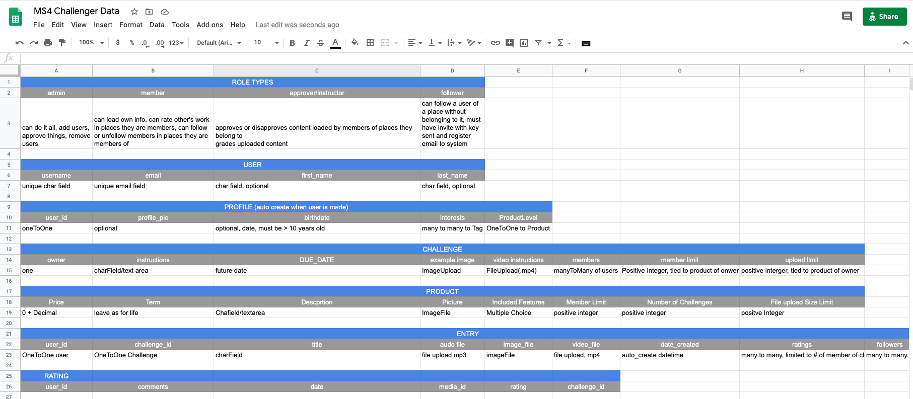

# Challenger Information Architecture
## Author
Malia Havlicek
>## Table of Contents
>- [Information Architecture](#information-architecture)
>- [Database Choice](#database-choice)
>  * [Data Models](#data-models)
>  * [Data Structure](#data-structure)
>    + [Tag](#tag)
>    + [User](#user)
>    + [Profile](#profile)
>      - [Model Functions](#model-functions)
>    + [Challenge](#challenge)
>      - [Model Functions](#model-functions-1)
>    + [Member](#member)
>    + [Order](#order)
>    + [ServiceLevel](#servicelevel)
>      - [Model Functions](#model-functions-2)
>    + [Rating](#rating)
>    + [RatingInput](#ratinginput)
>    + [TotalTrophies](#totaltrophies)
>    + [Entry](#entry)
>      - [Model Functions](#model-functions-3)
>
>- [Back to README](https://github.com/maliahavlicek/ms4_challenger#information-architecture)

# Information Architecture

During the ideation phase of this project, I roughed out the relationships for the data in a spreadsheet before working on the wire-frames so I'd have a better idea of what data I needed to collect: [](https://docs.google.com/spreadsheets/d/1vHY-Ml27WeuLCfXmMhxcf0v3VBArTMUdrv1BuL8twIQ/edit?usp=sharing)
 
Once the project was stable, and I got frustrated with attempting to draw out an ERD,  I discovered django has a wonderful plugin that will automatically draw one for you, here's the result:  
[](https://mmh-challenger.s3.us-east-2.amazonaws.com/media/how_to_videos/output.png)

# Database Choice
Django plays nicely with many relational databases, but PostgreSQL is a well documented, free/open-source relational database that can be added-on with Heroku at the Free pricing tier. 

- During development on my local machine I worked with the standard sqlite3 database installed with Django.
- For deployment, a PostgreSQL database is provided by Heroku as is an add on.

> Database configurations can be found in the settings.py file. The **DATABASE_URL** setting reflects the PostgreSQL url.
```python
if 'DATABASE_URL' in os.environ:
    DATABASES = {
        'default': dj_database_url.parse(os.environ.get('DATABASE_URL'))
    }
else:
    DATABASES = {
        'default': {
            'ENGINE': 'django.db.backends.sqlite3',
            'NAME': os.path.join(BASE_DIR, 'db.sqlite3'),
            'TEST': {
                'NAME': 'mytestdatabase',
            },
        }
    }

```

## Data Models

Data stored in the CHALLENGER App consists of the following types:

- CharField
- OneToOneField
- ImageField
- DateTimeField
- DateField
- ManyToManyField
- ForeignKey
- TextField
- FileField
- PositiveIntegerField
- MultiSelectField
- EmailField
- DecimalField

## Data Structure

There are X data structures associated with ms4_challenger:

- Tag

### Tag

Tags represent a User's interest. The main point of this optional data that is linked as a ManyToMany relationship to a user is to potentially target users either by paid marketing, or open challenges once the application is fully developed and there is a benefit to creating free public challenges to all users in the system.

| DB Field | Data Type  | Purpose                              | Model Validation | Form Validation |
|----------|------------|--------------------------------------|------------------|-----------------|
| Name     | Char Field | help profile user for challenges/ads | N/A              | N/A             |

Tags can only be created, updated and deleted, by admin users from the default django admin screen.

- [x] Create - A Tag is created by an Admin User from the default django admin screen. 
- [x] Read - The user profile object reads all entries from the Tag database and presents them as checkboxes as Interests on the user Profile Update screen. The relationship between Tags and a user are represented as bullet points on the Account Overview Screen.
- [x] Update - users can update the relationship between tags from the Update Profile Screen. Admins can update Tags via the django admin screen.
- [x] Delete - Admins can delete Tags via the django admin screen.

The default load of Tags can be triggered by typing the following command in a terminal window:
``` python manage.py loaddata tag.json```

### User

Django provides a rather robust basic user/authentication model out of the box.

| DB Field   | Data Type  | Purpose                         | Model Validation                                          | Form Validation                             |
|------------|------------|---------------------------------|-----------------------------------------------------------|---------------------------------------------|
| email      | EmailField | way to contact user             | required, email                                           | required, email, unique to system           |
| username   | CharField  | friendly screen name for user   | requried                                                  | required, default = email, unique to system |
| password   | CharField  | restricts access to system      | required, must be 8 characters an have #'s and characters | can't contain email or username             |
| first_name | CharField  | provide personalized experience | optional                                                  | optional                                    |
| last_name  | CharField  | provide personalized experience | optional                                                  | optional                                    |

- [x] Create - A user is created via the User Registration Page.
- [x] Read - The user object is passed around in the request once a user has logged in until they log out of the system.  The email is used to send challenge creation, updates and cancellation messages to users.
- [x] Update - users can update their password via the password reset page. They can update their username, email, first_name, and last_name from a link on the Account Overview page.
- [x] Delete - Admins can delete users via the django admin screen.

### Profile

A profile represents user customization/personalization. 

| DB Field     | Data Type       | Purpose                                  | Model Validation        | Form Validation |
|--------------|-----------------|------------------------------------------|-------------------------|-----------------|
| user         | OneToOne        | ties user to profile                     | required                | required        |
| profile_pic  | ImageField      | provides picture for user                | default to profile1.png | optional        |
| date_created | DateTimeField   | tracks how long user has been member     | auto_date_now           | N/A             |
| birth_date   | DateField       | ensures user is old enough to be member  | optional                | > 10 years      |
| tags         | ManyToManyField | tracks interests for ads/open challenges | optional                | optional        |
| product      | ForeignKey      | tracks service level of user             | optional                | default to Free |

A profile object is created when a user is created. Typically from the registration screen or automatically when a new email is entered in association with a member that is being added to a challenge. All the fields by definition are optional and the User can modify them if they want to from the Update Profile Page.

- [x] Create - A profile created by user registering or when a challenge master creates a challenge. 
- [x] Read - The profile data is accessed from the Account Overview page, update profile page. The challenge pages reads the product level to set properties for a challenge.
- [x] Update - users can update their profile form the update profile screen.
- [x] Delete - Admins can delete users via the django admin screen, which will cause the associated profile to be deleted.

#### Model Functions

- get_owned_challenges - gets list of challenges a user owns, None if none are found. This function is used to determine if a user can add more challenges, or is at their limit. It also helps determine if the user can rate a submission to a challenge or update a challenge.
- get_member_challenges - gets a list of challenges a user belongs to, None if none are found. This function is used to determine if a user can see a challenge, rate an entry or submit and entry.
- get_product_level - returns the product associated with the user's account and sets limits on the challenges the user creates or updates.
- get_tags - return s a list of tuples representing the tags in the database for the update profile page
- get_tag_values - returns a list of the interests the user has checked when updating their profile to display on their account overview page.
- create_user_profile - ensures a profile is auto created if a user is created
- save_user_profile - ensures associated profile is saved is a user is updated


### Challenge

A challenge is the biggest most integrated object of this project. Its relationships designate owners, members, and submissions.

| DB Field               | Data Type               | Purpose                                                                    | Model Validation          | Form Validation                          |
|------------------------|-------------------------|----------------------------------------------------------------------------|---------------------------|------------------------------------------|
| owner                  | ForeignKey              | track ownership so system knows which user can update/delete               | required                  | N/A user authentication                  |
| name                   | CharField               | Short Name for challenge                                                   | required, max_length 254  | max_length                               |
| description            | TextField               | Instructions/Description of challenge                                      | required, max_length 1000 | required                                 |
| example_image          | ImageField              | Provide example imagery/related image depicting purpose of challenge       | required                  | required                                 |
| example_video          | FileField               | Provide video insturctions                                                 | optional                  | optional, *.mp4 type=video/mp4           |
| start_date             | DateTiemField           | When to accept entries                                                     | required, default today   | required                                 |
| end_date               | DateTimeField           | When to stop accepting entries                                             | required                  | required, future, after start            |
| member_limit           | PostiveIntegerField     | Limit Number of Members to challenge based on service level of owner       | required                  | auto set based on service level of owner |
| video_time_limit       | PositiveIntegerField    | Limit Length of Video submission based on service level of owner           | required                  | auto set based on service level of owner |
| submission_storage_cap | PositiveIntegerField    | limit size of files stored by system based on service level of owner       | required                  | auto set based on service level of owner |
| submission_types       | MultiSelectField        | track type of files allowed to uploaded, limited by service level of owner | required                  | choices based on service level of owner  |
| members                | ManyToManyField -User   | Track users that are members of challenge                                  | optional                  | must be user, will auto create if needed |
| submissions            | ManyToManyField - Entry | Track submissions to challenge                                             | optional                  |                                          |

- [x] Create - A challenge is created when a user submits a validated create challenge form.
- [x] Read - A challenge shows up on the Challenges page under the Member Tab, Master Tab, on the Create Challenge Screen, Update challenge screen, Create Entry, Update Entry and See all submissions screens.
- [x] Update - Challenge masters can update a challenge via the Edit button on the Challenge Master Tab. Challenge Members update challenges when they submit an entry.
- [x] Delete - Challenge Masters can delete challenges from the challenge master tab. Admins can delete challenges via the django admin screen.

#### Model Functions

- is_closed - Checks current timezone against end_date. If end_date is in past, it return true. This function is used to determine is see submissions button should be shown on challenge member list tab or if submit/resubmit buttons can be displayed.
- get_submissions - provide a list of submissions associated with a given challenge, empty list if none. Helps formulate the all submissions carousel.
- get_members - provides a list of members associated with a challenge, empty list if none. This function is used to determine if a user has the correct permissions to submit an entry to a challenge.

### Member

A member is a placeholder model that is used by the member form on the create challenge and update challenge page. 

| DB Field   | Data Type  | Purpose              | Model Validation      | Form Validation                            |
|------------|------------|----------------------|-----------------------|--------------------------------------------|
| first_name | CharField  | populate user object | optional              | optional                                   |
| last_name  | CharField  | populate user object | optional              | optional                                   |
| email      | EmailField | populate user object | email field, required | required, must be unique to challenge list |

This object helps validate the ManyToMany relationship between users and challenges. The relationship is saved once a successful update or creation of a challenge with members is made.

- [x] Create - A member is created when a Challenge master designates an email in the members' list in the update or create challenge form.
- [x] Read - Access to submit entries, rate entries, view entries is controlled by reading the ManyToMany relationship between users and challenges.
- [x] Update - Challenge masters can update members in a challenge via the Edit button on the Challenge Master Tab. 
- [x] Delete - Challenge Masters can delete challenge members from the challenge master tab. 

If an email provided in the member list is not registered to the system, a user will be automatically generated using a random 4 character, 4 numeric password with the email as both the username and email fields. An email will be sent to users with their authentication credentials. A second email inviting them to a given challenge will be sent shortly after the welcome email.

### Order

The Order object is used to track payment status when a user upgrades or downgrades their product/service level.

| DB Field       | Data Type                 | Purpose                              | Model Validation                                                       | Form Validation           |
|----------------|---------------------------|--------------------------------------|------------------------------------------------------------------------|---------------------------|
| product        | ForeignKey - ServiceLevel | track what product user has paid for | required on creation                                                   | required                  |
| user           | ForeignKey - user         | track which user made the purchase   | required on creation                                                   | required, authorized user |
| total          | DecimalField              | Amount user paid                     | required, 0.00 - 1500.00                                               | required                  |
| date_created   | DateTimeField             | Track purchase timestamp             | required, auto_add_now                                                 | N/A                       |
| payment_status | CharField                 | track status of payment              | predefined choices('pending', 'payment_collected', 'payment_rejected') | required                  |

- [x] Create - An order is created when the user clicks the checkout button on the Free product, OR when the user clicks the submit payment button on a product with a price.
- [x] Read - Orders are read and displayed on the Account Overview page.
- [x] Update - Orders are updated if a payment was failed, then resubmited with success.
- [] Delete - Orders cannot be deleted unless the admin/superuser access the django admin screen to do such.

### ServiceLevel

ServiceLevels reflect the product a user purchases which represents a tiered level of services the MS4_Challenger provides to its users.

| DB Field                  | Data Type            | Purpose                                                            | Model Validation         | Form Validation |
|---------------------------|----------------------|--------------------------------------------------------------------|--------------------------|-----------------|
| name                      | CharField            | short, fancy descriptor of product                                 | required, max_length 254 | N/A             |
| price                     | DecimalField         | price of product                                                   | required, 0.00 - 1500.00 | N/A             |
| features                  | MultiSelectField     | application features provided by product                           | required                 | N/A             |
| description               | TextField            | marketing description of product                                   | required, max_length 200 | N/A             |
| max_members_per_challenge | PostiveIntegerField  | Track how many members a challenge can have                        | required, 1-1000         | N/A             |
| max_number_of_challenges  | PositiveIntegerField | Track how many challenges a user can proctor                       | required, 1-100          | N/A             |
| video_length_in_seconds   | PositiveIntegerField | Limit Length of Video submissions *future feature                  | required, 0-300          | N/A             |
| max_submission_size_in_MB | PositiveIntegerField | Limit size of files uploaded                                       | required, 0-10000        | N/A             |
| image                     | ImageField           | Iconic representation of product service related to other products | required                 | N/A             |
| date_created              | DateTimeField        | track product creation                                             | auto_now_add             | N/A             |


Products should eventually be updated to have a term which would reflect, price for life, monthly, and annual pricing commitments, but in initial development only a price for life point is provided.

- [x] Create - Products are created only by admin users. There is a default fixture/load command that will create them for developers that desire to cone the repository. 
- [x] Read - ServiceLevels are displayed on Challenge Pages, Entry Pages, the Checkout Page, Products List Page and the Account Overview.
- [x] Update - Only Admin users can update products form the django admin pages. 
- [x] Delete - Only Admin users can update ServiceLevels from the django admin screens. 

The default load of ServiceLevels can be triggered by typing the following command in a terminal window:
``` python manage.py loaddata servicelevel.json ```

#### Model Functions

- get_features_display_list - returns a list of the features associated with the product's multiSelectField.

### Rating

Ratings represent peer reviews of users' entries for a given challenge.

| DB Field     | Data Type            | Purpose                                             | Model Validation | Form Validation    |
|--------------|----------------------|-----------------------------------------------------|------------------|--------------------|
| rating       | PositiveIntegerField | Track relative rating of an entry                   | required, 1-3    | 1-3                |
| reviewer     | ForeignKey - user    | Track user that supplied rating                     | required         | authenticated user |
| date_created | DateTimeField        | potentially track peer influence vs original rating | auto_now_date    | N/A                |
| updated_date | DateTimeField        | potentially track peer influence vs original rating | auto_now_date    | today              |


- [x] Create - Ratings are created only by members and challenge masters of the same challenge.
- [x] Read - Ratings are shown on the Challenges Page and All Submissions Page.
- [x] Update - Peers can change their ratings any time when viewing all submissions.  
- [x] Delete - Ratings are only deleted if the challenge they are related to are deleted by the challenge master.

Ratings are displayed as an average based on a 3 trophy level as provided by each member and challenge master for a given challenge. 

### RatingInput

RatingInput is a data model used to help serialize user input for ratings.

| DB Field | Data Type            | Purpose                                  | Model Validation | Form Validation |
|----------|----------------------|------------------------------------------|------------------|-----------------|
| rating   | PositiveIntegerField | 1-3 numeric representation of user input | required         | N/A             |
| reviewer | PositiveIntegerField | pk for user making rating                | required         | N/A             |
| entry_id | PositiveIntegerField | pk for entry being rated                 | required         | N/A             |

Rating Inputs are not saved to the database, but used to validate the ajax inputs before creating or updating a rating

### TotalTrophies

TotalTrophies is the data model used to help serialize the ajax response once a valid RatingInput was received. It's basically the output of the get_rating model function for a given entry object.

| DB Field | Data Type    | Purpose                                             | Model Validation          | Form Validation |
|----------|--------------|-----------------------------------------------------|---------------------------|-----------------|
| trophies | DecimalField | Colors trophies to average peer rating for an entry | Min 0, max 1000, 5 digits | required        |
| entry_id | CharField    | pk of entry                                         | max_length 32             | required        |

TotalTrophies are not saved to the database, but used to validate the ajax response before sending back the aggregated peer rating. 

### Entry

Entries represent challenge members' submissions to a given challenge.

Entries can only be submitted by challenge members and viewed by members of the same challenge as well as the challenge master. A future feature will allow observers to view specific entries.

| DB Field     | Data Type                | Purpose                         | Model Validation         | Form Validation                                                               |
|--------------|--------------------------|---------------------------------|--------------------------|-------------------------------------------------------------------------------|
| user         | ForeignKey - user        | tracks owner of entry           | required                 | authenticated user, member of challenge                                       |
| image_file   | FileField                | image entry                     | optional                 | ImageField, required if Free product, sized by challenge master service level |
| audio_file   | FileField                | audio entry                     | optional                 | .mp3, audio/mp3 or audio/mpeg, sized by challenge master service level        |
| video_file   | FileField                | video entry                     | optional                 | .mp4, video/mp4, sized by challenge master service level                      |
| title        | CharField                | short description of entry      | required, max_length 300 | required                                                                      |
| date_created | DateTimeField            | track when user submitted entry | auto_date_now            | N/A                                                                           |
| ratings      | ManyToManyField - rating | peer ratings of entry           | optional                 | optional                                                                      |

- [x] Create - An entry is created when a user submits a validated create entry form on the Submit Entry page which is accessed from the 'Memeber' tab of the Challenges page. Creations can only occur between the start date and end dates designated by the challenge master.
- [x] Read - Entries are presented on the Update Entry screen, Challenge Member, and Challenge Master tabs.
- [x] Update - Entries can only be updated by the challenge members that created it within the time frame designated by the challenge master/owner. The only exception is the ability to have trophies/ratings awarded by peers reviewing submissions.
- [x] Delete - Entries can only be updated by the challenge members that created them. 

#### Model Functions

- get_rating - returns aggregated average of ratings associated to entry or 0.


- [Back to README](https://github.com/maliahavlicek/ms4_challenger#information-architecture)