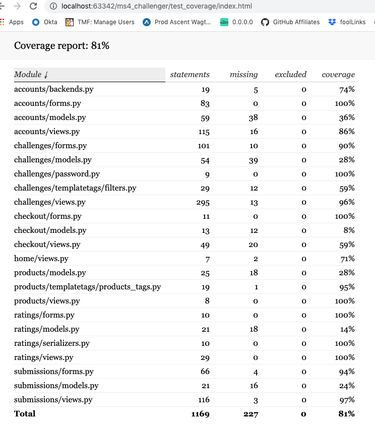

# Challenger TESTING
## Author
Malia Havlicek
>## Table of Contents
>- [Challenger TESTING](#challenger-testing)
>  * [Author](#author)
>  * [Table of Contents](#table-of-contents)
>- [Testing](#testing)
>  * [Validation Testing](#validation-testing)
>  * [Unit Testing](#unit-testing)
>  * [Cross Browser/Cross Device Verification](#cross-browsercross-device-verification)
>  * [Accessibility Testing](#accessibility-testing)
>  * [Automated Testing](#automated-testing)
>    + [Jasmine Tests](#jasmine-tests)
>      - [alignItems](#alignitems)
>      - [Members](#members)
>    + [Python Tests](#python-tests)
>    + [Travis](#travis)
>    + [Defect Tracking](#defect-tracking)
>      - [Noteworthy Bugs](#noteworthy-bugs)
>      - [Outstanding Defects](#outstanding-defects)
>
>- [Back to README](https://github.com/maliahavlicek/ms4_challenger#testing)

# Testing

Validation, manual unit, cross browser/cross device, accessibility, travis, coverage, jasmine, this app has a dash of everything test related.

## Validation Testing
- [CSS Validator](https://jigsaw.w3.org/css-validator/) Note, any error associated with root: color variables were ignored. 
- [HTML Validator](https://validator.w3.org/)  - validation of HTML with Django is pretty useless as all {{}} bracketed values raise errors. I ran only a few files through the validator and instead relied heavily upon pycharm's IDE to identify mismatched tags and closing Django directives.
- [django-extensions](https://pypi.org/project/django-extensions/) - used for validating templates from the command line ```python manage.py validate_templates```
- [JavaScript Validator](http://beautifytools.com/javascript-validator.php) Note any errors for let, variables set in other .js files, and constants were ignored. I also used a more [ES6 friendly checker](https://www.piliapp.com/syntax-check/es6/) and there were no errors for main.js
- [Pycharm IDE](https://www.jetbrains.com/pycharm/download) - PyCharm has inline validation for many file types. Python, CSS, HTML, DJANGO files were continuously tested for validity when using this IDE.

## Unit Testing

As core functionality and features were delivered I attempted to create python tests to ensure functionality was not lost. I got behind after a point, but made up ground at the end to get some coverage of all models, forms and views.

## Cross Browser/Cross Device Verification

To verify that the application is functional and looks pleasant across various operating systems and device sizes I devised a suite of manual tests in the cross browser tab of my [testing workheet](https://docs.google.com/spreadsheets/d/1011tpcN2H_-x_ap1NNLjmoQNoOK4PhQefKWk6F610rE/edit?usp=sharing) on the cross browser tab.

Please note: Since flex grid is the basis of CSS IE 11 and ios lower than 11 will not render the app nicely.

These tests are light on the functionality with more attention being paid to the layout and console logs:

The matrix for the browsers, operating systems and screen sizes is as follows:

|       TOOL      	|    DEVICE    	| BROWSER 	|    OS   	|   SCREEN WIDTH  	|
|:---------------:	|:------------:	|:-------:	|:-------:	|:---------------:	|
|       N/A       	|    motog6    	|  chrome 	| android 	| XS 360px & less 	|
|  browser stack  	|   iphone7   	|  safari 	|   iOs   	| XS 360px & less 	|
| chrome emulator 	|    pixel 3   	| firefox 	| android 	|    M 361-576    	|
|   browserstack  	|  iPhone 10x  	|  Chrome 	|   iOs   	|    M 361-576    	|
|   browserstack  	|     nexus 7  	|  Chrome 	| android 	|  T-vert 571-768 	|
|   browserstack  	|   ipad mini  	|  safari 	|   iOs   	|  T-vert 571-768 	|
|   browserstack  	|    galaxy    	| firefox 	| android 	|  T-hor 769-1024 	|
| chrome emulator 	|     ipad     	|  safari 	|   iOs   	|  T-hor 769-1024 	|
|   browserstack  	|       ?      	|  Chrome 	| windows 	|   HD 125-1240   	|
|       N/A       	| mac book pro 	|  safari 	|  Mohave 	|   HD 125-1240   	|
|   browserstack  	|       ?      	| firefox 	| windows 	|   HD 125-1240   	|
|   browserstack  	|       ?      	| IE Edge 	| windows 	|   HD 125-1240   	|

Another part of my cross browser testing was hitting each page in each view port with the chrome emulator for a smaller phone and copying the following javascript  into the developer's tools console screen. 
```javascript
var docWidth = document.documentElement.offsetWidth;
[].forEach.call(document.querySelectorAll('*'),function(el){if(el.offsetWidth > docWidth){console.log(el);}});
```
This snippet grabs all elements in the DOM and outputs offending elements that exceed the width of the screen to the console. If the output is "undefined", then I can be 99% certain that users will not experience any odd horizontal scrolls on their devices. Running this helped me identify and fix margin issues on small devices for the modals and the icon picker for the update event flow.

## Accessibility Testing

I try to ensure I build websites that can be used by people with vision and hand dexterity impairments. 

To test accessibility I use a combination of these two tools:
- [axe](https://chrome.google.com/webstore/detail/axe-web-accessibility-tes/lhdoppojpmngadmnindnejefpokejbdd?hl=en-US) 
- [google's lighthouse audit](https://developers.google.com/web/tools/lighthouse) 

These tests are manual and are tracked on the Accessibility Tab of my [testing doc](https://docs.google.com/spreadsheets/d/1011tpcN2H_-x_ap1NNLjmoQNoOK4PhQefKWk6F610rE/edit?usp=sharing).


## Automated Testing
**NOTE** If you want to run these tests, make sure you have cloned this project form [github](https://github.com/maliahavlicek/ms4_challenger) by following the steps in the [local deployment section](https://github.com/maliahavlicek/ms4_challenger#deployment) of the README.md file.

### Jasmine Tests
I wrote automated tests for the two bits of javascript that are key to the functionality of this website:

#### alignItems
Several pages in the site use a function that matches heights based on CSS selectors after page load to make the pages look much more presentable to end users. The home page, the products page and the see all entries pages uses the [utils.js alignItems function](https://github.com/maliahavlicek/ms4_challenger/blob/faf2ff1bc4c404cc862d860159dc58da601f4a30/static/js/utils.js#L5).


HTML page to run alignItems tests from: testing/jasmine/jasmine-heights-testing.html
Test Specifications: testing/jasmine/spec/test_heights_function.js

#### Members
The Create Challenge and Update Challenge pages use the functions in the [challenge.js](https://github.com/maliahavlicek/ms4_challenger/blob/faf2ff1bc4c404cc862d860159dc58da601f4a30/challenges/static/js/challenge.js#L16) file to help manage member entry.


HTML page to run alignItems tests from: testing/jasmine/jasimine-member-testing.html
Test Specifications: testing/jasmine/spec/test_members_function.js

### Python Tests
Tests were written for Django views, forms, models. These files are located in each application specific /test folders and named in the following manner:

- test_forms.py - for tests concerning forms
- test_models.py - for tests concerning models
- test_views.py - for tests concerning views

Overal

[django-nose](https://pypi.org/project/django-nose/) was used to help configure and run the python tests with coverage output. The configurations are stored in the [.coveragerc](https://github.com/maliahavlicek/ms4_challenger/blob/master/.coveragerc) file.

To run these tests go to the command terminal and:
1. ```python manage.py test --noinput --settings ms4_challenger.settings_test ```
1. Generate a report ```coverage report```
1. Generate the HTML ```coverage html```
1. Open the newly created test_coverage directory in the root of your project folder.
1. Open the index.html file inside it.
1. Run the file in the browser to see the output.

Because testing requires a local db and local storage I found myself accidentally checking in the wrong settings.py version. After the 5th plus time I finally reached out to a Tim White, my boss and work member on how to override key parts of the settings.py file with an environment specific one. [settings_text.py]() 

When coverage was first configured and integrated on May 18, 2020 it was at 25%:


Clicking on the items with less than 100% coverage helped identify holes in my test coverage and allowed me to get cover up to 80% of the code.

On June 6, 2020, the resting coverage was up to 80%:



Yes 123 test cases is a lot. This is a huge app and I am not a tester by nature, but I wanted to become more efficient at writing test cases and learn how not to daisy chain them together. Ideally this set would be scoped down to the more fragile code pieces, but they did help identify a few fringe defects I would have left in the code otherwise.

### Travis
Travis was used throughout the unit testing of this project to provide continuous integration testing when pushing code to GitHub. Travis basically runs the command ```python manage.py test --noinput --settings ms4_challenger.settings_test``` against a python 3.7 environment built with the requirements.txt file. It's configured via the [.travis.yml](https://github.com/maliahavlicek/ms4_challenger/blob/master/.travis.yml) file.

Heroku settings for this project were configured to only allow deployment when the travis build tests had passed the latest push to the master branch on GitHub. This prevented a broken environment many times.  If you dare to be horrified by my trends of red, feel free to look at my [travis insights](https://travis-ci.org/github/maliahavlicek?tab=insights) for the past month.


As of June 6, 2020, travis success rates for the ms4_challenger app had stabilized with a higher success rate and higher deployment rate.


### Defect Tracking
Once I finished the initial layout of my file structure and had roughed in the base html, I began tracking [defects](https://docs.google.com/spreadsheets/d/161VXfe9ELN-CZMsHYaJfk8WoItRxhoAkscJhY_fMjdc/edit?usp=sharing) in a google sheet. They ranged from severely horrible coding errors, to the realization that my features were not 100% defined and I could make the user experience better.
[](https://docs.google.com/spreadsheets/d/161VXfe9ELN-CZMsHYaJfk8WoItRxhoAkscJhY_fMjdc/edit?usp=sharing)

#### Noteworthy Bugs
The most painful bugs always seem to show up right before you submit your project or have a meeting with your mentor. Everything works fine in your local and oops, you checked in a bad settings.py file, or suddenly heroku is off because of file storage differences between production and your local environment.

Here are a list of some of the craziness I encountered:

| Short Name                                  | Description                                                                                                                     | Resolution                                                                                                                                                                                                                                        |
|---------------------------------------------|---------------------------------------------------------------------------------------------------------------------------------|---------------------------------------------------------------------------------------------------------------------------------------------------------------------------------------------------------------------------------------------------|
| Bad settings.py again                       | I lost track of how many times 5-10? I checked in my settings.py <br>with if not DEBUG around either storage or testing engines | On June 2nd I talked to a co-worker and finally figured out how to use <br>a settings_test.py file to override some of the settings.py values.                                                                                                    |
| Account Profile Update error = empty form   | User updates profile but misses birthdate field. Avatar and <br>interests are gone. Even if successfully set.                   | 1. form create with an instance=request.user.profile<br>2. If it's a POST use the request.POST data,<br>3. If post and invalid, check the changed items and use the cleaned data<br>4. If not changed but not in cleaned data, then make it empty |
| Ratings on top of Entry image on iOs safari | Only in safari ipads, iphones and macbooks were the ratings not<br>showing below the entry.                                     | It's a loading thing and on page Ready jQuery for safari had image <br>heights of 0. Added a timeout function before resizing.                                                                                                                    |
| Misaligned Columns on Product Pages         | Bootstrap cards would match card title, body and footer but not <br>things in body. It looked wonky                             | Read up that bootstrap cards are not 100% flexbox, so added jQuery to<br> match heights based on class names.                                                                                                                                     |
| 500 error in production, local Django error | I got a dreaded yellow syntax error of doom when showing things <br>off to my mentor during my mid-project review.              | Entries were made before the model changed to required image, some <br>images were being displayed without an if image check first. This caused<br>me to create custom 404 and 500 pages.                                                         |
| Create Challenge Not respecting User Dates  | User selected dates are totally ignored and both start and end <br>dates are today, update works fine                           | Data model had auto_add_now=True, which ignores any other inputs, set <br>default=auto_add_now                                                                                                                                                    |
| Heroku 405 error on rating/send post        | Had X-CSRFToken in fetch heading, had Host set up, works great <br>locally, but Heroku had console errors                       | Updated settings.py with REST_FRAMEWORK and set up <br>DEFAULT_PERMISSION_CLASSES and DEFAULT_AUTHENTICATION_CLASSES                                                                                                                              |
| Update Challenge goes to 500                | Update a challenge with a video, but don't change the video when <br>updating gave a 500 error in heroku.                       | AWS vs Local Storage content_type is in a different spot. I added and <br>instance check like  ```isinstance(example_video, S3Boto3StorageFile):``` <br>around audio and video file uploads. ImageType fields doesn't run into <br>this issue.    |
| Update Profile, service level product lost  | When updating the profile, you come back to the service level <br>page and there is 1/ __ challenges being reported.            | Need to update request with updated user otherwise product level is lost.                                                                                                                                                                         |

#### Outstanding Defects

- Takes a while to get to the next page when uploading files - I should add in a file processing status bar so user's know what is going on. The static state of the selected submit button is some visual indicator but I should prevent user input during this wait.
-  Inefficient Email - I should use a celery task or distributed system to handle emailing users. Right now it's all inline and not done asynchronously thus adding to the time it takes to create or update a challenge.
- No system timeout - User's login seems to last forever, should auto log users out after half an hour to keep accounts secure


- [Back to README](https://github.com/maliahavlicek/ms4_challenger#testing)