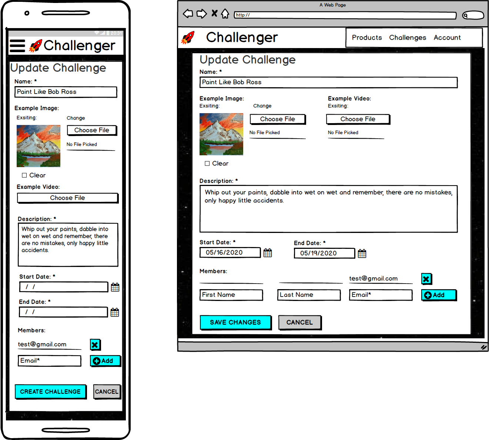
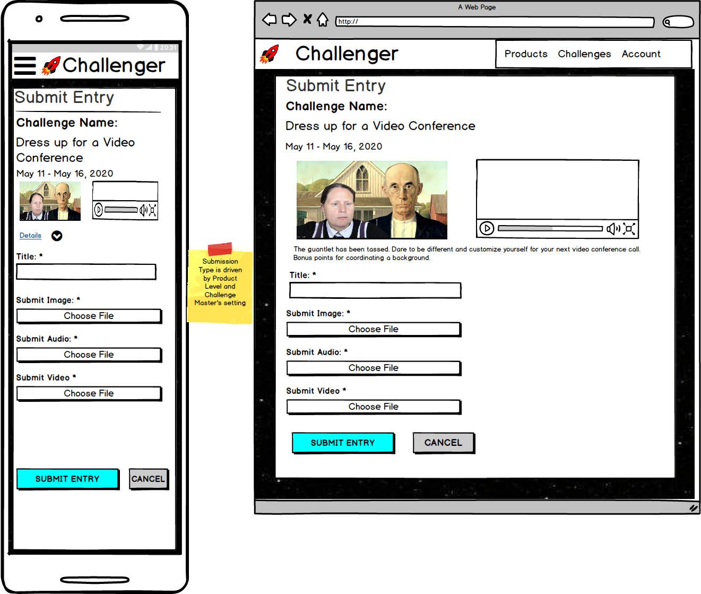

# Challenger Wire-frames
## Author
Malia Havlicek
>## Table of Contents
> - [Home Page - Unauthenticated](#home-page---unauthenticated)
> - [Home Page - Authenticated](#home-page---authenticated)
> - [Known User](#known-user)
> - [Login](#login)
> - [Forgot Password](#forgot-password)
> - [Forgot Password Email Sent](#forgot-password-email-sent)
> - [Forgot Password Email](#forgot-password-email)
> - [Reset Password](#reset-password)
> - [Password Reset Complete](#password-reset-complete)
> - [Register](#register)
> - [Account Overview](#account-overview)
> - [Edit Profile](#edit-profile)
> - [Product List](#product-list)
> - [Checkout](#checkout)
> - [Challenges - Create](#challenges---create)
> - [Edit Challenge](#edit-challenge)
> - [Challenges - Master List](#challenges---master-list)
> - [Challenges - Member List](#challenges---member-list)
> - [Submit Entry](#submit-entry)
> - [Update Entry](#update-entry)
> - [See All Entries](#see-all-entries)
> - [Back to README](https://github.com/maliahavlicek/ms4_challenger#wireframes)

### Home Page - Unauthenticated

- Copied layout roughly from teamsnap.com
- email entry to really occupy space and to get users to interact

### Home Page - Authenticated

- Copied layout roughly from teamsnap.com
- If user is authenticated, home page may be upated to house FAQs
- User can land on page authenticated or unauthenticated, menu changes slightly 

### Known User

- If user enters email on start page, we check if user exists in system or not
  - Provides friendly messaging to pre-existing users

### Login

- Collect User authentication Credentials
- Extended Basic Login to allow user to enter username or email
- reset proximity
- form validation & proximity error messaging
- on success, take user to challenges page

### Forgot Password

- sends email to user if email is in system with token based reset password link

### Forgot Password Email Sent

- Page telling user to expect a password reset email.

### Forgot Password Email

- Email containing password reset link
  
### Reset Password

- Collects Password twice before resetting value in system
- upon success, directs user to password reset complete page

### Password Reset Complete

- Notification about successful password reset urging user to login

### Register

- User must be logged out
- Page collecting username, email, password, password confirmation
- Checks for system uniqueness for email and username
- When successful, take user to products page as an authenticated user
 
### Account Overview

- User must be authenticated
- Summarizes user's information and provides links to make changes:
  - Details
  - Profile Info
  - Service Level Agreement 
- Accessed from Authenticated User Menu

### Edit Profile 

- User must be authenticated
- display profile form field with values prepopulated
- allow user to change values
- when save is successful take user to Account Overview Page
- cancel takes user to Account Overview Page

### Product List

- User can be authenticated or logged out
- show products as configured by admin
- present user with option to checkout
- if user is authenticated and has a product, label as owned 
- if user clicks checkout and is not authenticated, make them login
- if user is authenticated and clicks checkout, if product is FREE, skip payment collection and go to Account overview page
- if product is not free, collect payment with Stripe API

### Checkout

- Collect Payment
- If payment is successful, update Service Level
- If payment is not successful, show errors and keep previous Service Level
- Successful Payment goes to Account Overview Page

### Challenges - Create

- User must be Authenticated
- Only allow user to create a challenge if they are not up to Service Level Limit
- Limit number of members being added to Service Level
- Limit type of submission based on Service level
- Only required form fields are: Name, Description, start date, end date, and Submission Type
- end date must be in future and after start date
- Success leads to Challenges Master Tab
- Cancel takes user to Challenges Master Tab
- upon success email members about challenge

### Edit Challenge 

- User must be logged in
- User must be owner of challenge
- show form with prepopulated fields
- allow user to change members
- Only required form fields are: Name, Description, start date, end date, and Submission Type
- end date must be in future and after start date
- Success leads to Challenges Master Tab
- Cancel takes user to Challenges Master Tab
- upon success email members about challenge

### Challenges - Master List 

- User must be logged in
- User must be owner of challenges
- List out challenges current user manages
- supply edit, delete, and see entries buttons for owned challenges
- order by end date descending, then name

### Challenges - Member List

- User Must be logged in
- User must be a member of the challenges displayed
- List out challenges ordered by end date descending, then by name
- Display more details for challenges without entries
- Display re-submit for challenges with entries that still are live (aka end date is in future)
- Display See Entries button for challenges with entries that are not live (aka end date is in past) 

### Submit Entry

- User must be logged in and a member of a challenge with end date in future
- recap challenge
- present name and file uploader to user
- upon success take user to challenges members list, they should see the date they submitted and file uploaded
- upon success email owner about submission

### Update Entry

- User must be logged in and a member of a challenge with end date in future
- recap challenge
- recap previously submitted entry
- prepopulated present name and file uploader to user
- upon success take user to challenges members list, they should see the date they submitted and file uploaded
- cancel takes user to challenges member list
- upon success email owner about submission

### See All Entries

- User must be logged in and a member with end date in past
  - or 
- User must be logged in as owner of challenge with submissions
- recap entry
- present summary of trophies awarded by peers
- present rating for each entry
- preselect rating for each entry if feedback already given but allow real time updating
- provide pagination navigation to next entry
- provide count so user knows which entry they are on

- [Back to README](https://github.com/maliahavlicek/ms4_challenger#wireframes)